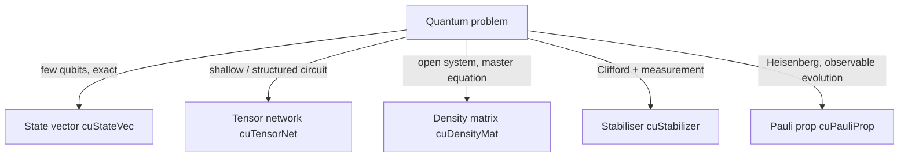

# 01 Quantum Primer

This chapter introduces the formalism we need to read the rest of the paper. Readers with a physics background can skim it for notation. We focus only on what cuQuantum actually models: pure states, mixed states, gates, measurements, Pauli operators, channels, and a small slice of stabiliser theory. There is no attempt at completeness.

## 1.1 The state of a single qubit

A qubit is a vector in $\mathbb{C}^2$ of unit norm:

\[
|\psi\rangle = \alpha\,|0\rangle + \beta\,|1\rangle, \qquad |\alpha|^2 + |\beta|^2 = 1.
\]

The two basis vectors $|0\rangle = (1,0)^T$ and $|1\rangle = (0,1)^T$ stand for "off" and "on" but carry the additional structure that the coefficients $\alpha, \beta$ are complex numbers. Two complex coefficients with one normalisation constraint and one global-phase symmetry give two real parameters, which is why a qubit is often pictured on the surface of the Bloch sphere.

## 1.2 Many qubits and the curse of dimensionality

The state of $n$ qubits lives in the *tensor product* space $(\mathbb{C}^2)^{\otimes n} = \mathbb{C}^{2^n}$:

\[
|\Psi\rangle = \sum_{x \in \{0,1\}^n} c_x\, |x\rangle, \qquad \sum_x |c_x|^2 = 1.
\]

This vector has $2^n$ complex components, so memory grows exponentially in the number of qubits. With double-complex (16 bytes per amplitude), a 30-qubit state already needs 16 GB; 33 qubits need 128 GB. This is the wall that motivates almost every algorithmic decision in cuQuantum.

Two strategies for not hitting it:

- **State-vector simulation** (cuStateVec) stores the full vector and applies gates as matrix-vector products; it is exact and scales to roughly 30-40 qubits depending on hardware.
- **Tensor-network simulation** (cuTensorNet) stores the state implicitly as a contracted network of small tensors; the cost depends on circuit *structure* rather than the number of qubits, and can reach hundreds of qubits when the structure is favourable.

Mixed states (chapter 30, cuDensityMat) and stabiliser states (chapter 40, cuStabilizer) explore further trade-offs that we develop in those chapters.

## 1.3 Gates as unitary matrices

A *gate* is a unitary matrix $U$. Acting on a state vector simply means multiplying:

\[
|\psi'\rangle = U\,|\psi\rangle.
\]

Useful single-qubit gates:

\[
\mathsf{H} = \tfrac{1}{\sqrt{2}}\begin{pmatrix}1 & 1\\1 & -1\end{pmatrix},\quad
X = \begin{pmatrix}0 & 1\\1 & 0\end{pmatrix},\quad
Y = \begin{pmatrix}0 & -i\\ i & 0\end{pmatrix},\quad
Z = \begin{pmatrix}1 & 0\\0 & -1\end{pmatrix}.
\]

Useful two-qubit gates: the controlled-NOT $\mathrm{CNOT}$, controlled-$Z$, $\mathrm{SWAP}$, and the controlled rotations $C\!R_x, C\!R_y, C\!R_z$.

A gate that acts on $k$ specific qubits inside an $n$-qubit register is implemented as the Kronecker product

\[
G_{\text{full}} = I^{\otimes (n-k-?)} \otimes G \otimes I^{\otimes ?},
\]

but cuQuantum never actually forms $G_\text{full}$. Instead it views the $2^n$ amplitude array as a $2^k \times 2^{n-k}$ matrix (after permuting axes so the targeted qubits are leading), multiplies the *small* $2^k \times 2^k$ matrix $G$ from the left, and permutes back. This reduces the cost of a $k$-qubit gate from $O(4^n)$ (forming $G_\text{full}$) to $O(2^k \cdot 2^n)$ (matrix-vector on the reshaped array). Chapter 10 walks through this in detail.

## 1.4 Measurements

A *projective measurement* in the computational basis observes some subset of qubits and projects the state onto the agreeing basis vector. If we measure all qubits at once, the outcome is a bit string $x \in \{0,1\}^n$ with probability $p(x) = |c_x|^2$. After observing $x$, the state collapses to $|x\rangle$.

If we measure only a subset $S$ of qubits and observe outcome $b \in \{0,1\}^{|S|}$, we *marginalise*:

\[
p(b) = \sum_{x: x_S = b} |c_x|^2,
\]

and the unmeasured qubits remain in the conditional (renormalised) state.

cuStateVec exposes both bulk sampling (`custatevecSampler*`) and explicit measurement and collapse on selected qubits (`custatevecMeasureOnZBasis`, `custatevecBatchMeasure`). The implementation walks the squared-amplitude array as a probability distribution and uses inverse-CDF sampling. We dissect this in [10-custatevec.md](10-custatevec.md).

## 1.5 Mixed states and density matrices

A *mixed state* describes a statistical ensemble of pure states. Its primary representation is the *density matrix*:

\[
\rho = \sum_i p_i\, |\psi_i\rangle\langle\psi_i|,\qquad p_i \ge 0,\ \sum_i p_i = 1.
\]

A density matrix is positive semidefinite and has trace 1. A pure state is the special case $\rho = |\psi\rangle\langle\psi|$.

The set of operators acting on density matrices and preserving these properties is exactly the set of *quantum channels* or *completely positive trace-preserving (CPTP) maps*. A channel $\mathcal{E}$ admits a Kraus representation:

\[
\mathcal{E}(\rho) = \sum_k K_k\, \rho\, K_k^\dagger,\qquad \sum_k K_k^\dagger K_k = I.
\]

Two interpretations:

- **Average over noise:** the channel describes the state once we have averaged over what the environment did.
- **Trajectory unravelling:** if we sample one Kraus index $k$ per "trajectory", we get a stochastic pure-state evolution whose ensemble average reproduces $\rho$.

cuDensityMat (chapter 30) maintains $\rho$ and computes its evolution under a *Liouvillian* $\mathcal{L}$:

\[
\dot\rho = \mathcal{L}(\rho) = -i[H, \rho] + \sum_j \left(L_j \rho L_j^\dagger - \tfrac{1}{2}\{L_j^\dagger L_j, \rho\}\right),
\]

the *Lindblad master equation*. cuTensorNet's experimental trajectory-noise APIs (chapter 21) instead unravel the channel into many pure-state runs and average expectation values across them.

## 1.6 Pauli operators

The *Pauli group on $n$ qubits* is the set of operators $P = i^c\, P_1 \otimes \cdots \otimes P_n$ with $P_i \in \{I, X, Y, Z\}$ and $c \in \{0, 1, 2, 3\}$. Three properties make it indispensable:

1. The Paulis form an orthogonal basis for $2^n \times 2^n$ Hermitian matrices; any Hamiltonian can be written $H = \sum_P h_P\, P$.
2. Two Paulis either commute or anticommute, never anything in between.
3. Conjugation by a *Clifford* gate maps Paulis to Paulis (up to a $\pm 1$ phase). This is the algebraic engine behind the Gottesman-Knill theorem and behind cuStabilizer (chapter 40) and cuPauliProp (chapter 50).

In cuStateVec we usually encounter Paulis as observables: *expectation* of a Pauli string $P$ is

\[
\langle P\rangle_\psi = \langle\psi|P|\psi\rangle,
\]

which the library computes without ever materialising $P$ as a $2^n \times 2^n$ matrix - it walks the targeted qubits directly. See `samples/custatevec/custatevec/expectation_pauli.cu`.

## 1.7 Stabiliser formalism in one page

A *stabiliser state* of $n$ qubits is a common $+1$-eigenstate of $n$ commuting Pauli operators (the "stabilisers"). Equivalently, it is the unique state stabilised by an abelian subgroup of the Pauli group of size $2^n$. The set of stabiliser states is closed under Clifford gates (Hadamard, phase, CNOT) and computational-basis measurement. We can therefore simulate any Clifford+measurement circuit in time polynomial in $n$ by tracking stabilisers rather than amplitudes - this is the *Gottesman-Knill theorem*.

cuStabilizer (chapter 40) exploits this for two huge applications:

- **Frame simulation** of Clifford-dominated circuits (most quantum-error-correction circuits).
- **Detector error model (DEM) sampling** for QEC decoder benchmarking, where we draw bit-strings of "syndromes" from a sparse parity-check code defined by the DEM.

The non-Clifford gates (T, $\mathrm{CCX}$, arbitrary rotations) break Gottesman-Knill, which is why cuStabilizer is purpose-built for the Clifford-dominated regime; for general circuits one wants cuStateVec or cuTensorNet.

## 1.8 The Heisenberg picture

In the *Schrödinger picture* gates act on states: $|\psi\rangle \mapsto U|\psi\rangle$. In the *Heisenberg picture* states stand still and gates act on observables: $O \mapsto U^\dagger O U$. For computing expectations the two pictures agree, $\langle\psi| (U^\dagger O U) |\psi\rangle = \langle\psi'| O |\psi'\rangle$, but they have very different computational footprints.

If $O$ has a sparse Pauli expansion $O = \sum_P o_P P$, the Heisenberg picture only needs to track how the *Pauli strings* evolve under conjugation. For Cliffords each Pauli stays a single Pauli; for non-Clifford rotations a single Pauli expands into a small linear combination of Paulis; for noise channels each Pauli becomes a probabilistic mixture. As long as we *truncate* the expansion (drop Paulis whose coefficients fall below a threshold, or cap the number of distinct Paulis we track) the cost stays manageable even for large $n$. This is exactly the regime that cuPauliProp (chapter 50) targets.

## 1.9 What lives where

Each library chapter restates the choice from its own point of view.

## Further reading

- Nielsen and Chuang, *Quantum Computation and Quantum Information*, especially chapters 2-4 and 10.
- Preskill's lecture notes (Caltech Ph229) for stabiliser formalism.
- Gottesman, "The Heisenberg representation of quantum computers", `arXiv:quant-ph/9807006`.

Continue to [02-gpu-primer.md](02-gpu-primer.md) or jump to [03-cuquantum-overview.md](03-cuquantum-overview.md).
