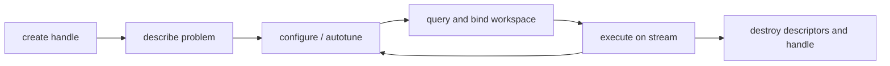

# 02 GPU Primer

This chapter covers just enough GPU computing to read the rest of the paper. We assume you have written CPU code in C, C++, or Python and want a working mental model for *why* cuQuantum is shaped the way it is.

If you are already a CUDA practitioner, skim §2.5 (handles, streams, workspaces) since those concepts dominate the cuQuantum API surface.

## 2.1 What an NVIDIA GPU is, in one paragraph

An H100 is a chip with ~16,000 single-precision arithmetic units organised into ~130 *streaming multiprocessors* (SMs). Each SM executes threads in lockstep groups of 32 (a *warp*). A typical kernel launches tens of thousands of threads at once and the hardware schedules them across the SMs. The point of view that matters for cuQuantum: a GPU is a giant batch-processor with extremely high arithmetic throughput (~60 TFLOP/s FP64, ~3 PFLOP/s FP16 with tensor cores on H100) attached to high-bandwidth memory (~3 TB/s on HBM3) but *high latency to the CPU* (microseconds per kernel launch, milliseconds per host-device transfer over PCIe).

The two performance corollaries are:

- **Throughput, not latency.** Anything you can express as a big array operation is fast. Anything that needs many small launches with control flow on the CPU side is slow.
- **Memory dominates.** For typical quantum simulation kernels (which are memory-bound matrix-vector products), the binding constraint is HBM bandwidth, not FLOPs.

cuQuantum's design follows from those two points.

## 2.2 The memory hierarchy that matters here

| Level | Capacity (H100 PCIe) | Bandwidth | Notes |
|---|---|---|---|
| Registers | tens of KB per SM | ~1 PB/s | Compiler-managed |
| Shared memory | 228 KB per SM | ~30 TB/s | Block-scoped scratchpad |
| L2 cache | 50 MB | ~5 TB/s | Chip-wide |
| HBM3 ("device memory") | 80 GB | ~3 TB/s | Where state vectors live |
| Host RAM (over PCIe Gen5 x16) | system | ~64 GB/s | "Cold" storage |

For state-vector simulation the state lives in HBM. A 30-qubit complex-double state is 16 GiB, comfortably resident; a 32-qubit state at 64 GiB needs all of HBM and pages much above that. For tensor networks the working tensors are usually tiny (KB-MB range) and the interesting question is whether you can keep them resident across many contraction steps.

cuQuantum exposes *workspace pointers* on every API that does heavy work; you allocate a buffer once and the library reuses it for scratch. The `MemHandler` mechanism lets you plug in your own allocator (a memory pool, a CuPy mempool, a PyTorch caching allocator) so cuQuantum scratch and your tensors share a pool.

## 2.3 Streams and asynchrony

A *CUDA stream* is an in-order queue of GPU work. Different streams can execute in parallel as long as their data does not collide. Almost every cuQuantum operation that touches the device takes a `cudaStream_t` argument and is asynchronous with respect to the host: control returns immediately and the work runs at some later moment.

This matters for cuQuantum in three ways:

1. **Overlap.** You can launch a contraction on one stream while preparing the next set of operands on another. The high-level Python `cuquantum.tensornet` takes streams via `options=` and reuses them across calls.
2. **Synchronization.** If you need a result on the host (e.g. a sampled bit string), you must `cudaStreamSynchronize()` (or `stream.synchronize()` in CuPy/Torch) before reading. cuQuantum's blocking convenience methods handle this for you; the lower-level entry points do not.
3. **Reproducibility.** Order of asynchronous operations is what it appears to be inside one stream and unspecified across streams. Random samplers in cuStateVec take a seed; if you also want byte-for-byte reproducibility you must additionally pin the stream.

## 2.4 Multi-GPU and multi-node, in shorthand

Three primitives appear repeatedly:

- **NCCL.** NVIDIA Collective Communications Library. Handles all-reduce, broadcast, all-to-all between GPUs. Used by cuTensorNet's distributed contraction and cuDensityMat's distributed states.
- **MPI.** Message Passing Interface. The portable rank-and-message abstraction for multi-node runs; cuQuantum integrates with the user's MPI via `mpi4py` (Python) or directly (C). Most distributed cuQuantum APIs accept a NCCL communicator and additionally an MPI communicator for setup-time coordination.
- **CUDA-aware MPI / GPUDirect RDMA.** Allows MPI buffers to be device pointers, avoiding host staging copies. This is a system-level configuration concern, not a cuQuantum knob.

The single-node multi-GPU concept that recurs in cuStateVec is **subSV migration**: when the full state does not fit in one GPU, the library partitions amplitude space into "sub-state vectors", places each on a different device, and migrates pages between devices and host as gates demand them. See `samples/custatevec/custatevec/subsv_migration.cu`.

## 2.5 The cuQuantum API style: handle, descriptor, workspace, stream

Almost every cuQuantum API call belongs to one of five phases. Recognising the phase is the most useful thing this primer can teach you.

1. **Create handle.** A `<lib>Handle_t` is a long-lived opaque object. It owns CUBLAS / CUTENSOR contexts, an internal stream, RNG state, and per-device caches. You make one per device per process and reuse it.
2. **Describe.** You construct *descriptors* that describe the abstract problem: a tensor network's connectivity (`cutensornetNetworkDescriptor_t`), a state (`custatevecState_t`), an operator term, and so on. Descriptors hold metadata only; no GPU work has happened yet.
3. **Configure.** Often via attribute setters: optimiser knobs, memory-pool callbacks, autotuning preferences. `cutensornetContractionAutotune` is the canonical example - the library times candidate kernels and remembers the winner.
4. **Workspace.** The library tells you how much scratch it needs; you allocate (or reuse) a buffer and bind it. This decouples cuQuantum's memory needs from yours.
5. **Execute.** Finally a `compute` / `apply` / `sample` / `contract` call performs the actual work on a stream. You may execute repeatedly with new operand pointers - the descriptor and configuration are reusable.

The Python bindings collapse phases 2-5 into single high-level calls (`cuquantum.tensornet.contract(...)`, `cuquantum.bindings.custatevec.apply_matrix(...)`) but the same phases are still happening underneath; for non-trivial workloads you will reach for the phased APIs to amortise descriptor and autotune costs.

## 2.6 Floating-point precision

Three precisions matter in this paper:

- **FP64 / complex128.** Default for state-vector simulation; matches typical reference implementations.
- **FP32 / complex64.** Halves memory and roughly doubles bandwidth. Acceptable for many circuit-level applications. cuQuantum supports it on every entry point that takes amplitudes.
- **FP16 / BF16.** Used inside CUTENSOR's tensor-core paths for tensor-network contractions when the user opts into mixed precision. Mostly transparent except as a knob.

Two warnings:

- Trotterised time evolution and variational optimisation often *do* benefit from FP64 because they accumulate small errors over many steps.
- Pauli expectations $\langle P \rangle$ near zero are sensitive: relative error blows up. Use FP64 for those even when the rest of your pipeline is FP32.

## 2.7 The roofline view, applied

For state-vector gate application, the dominant cost per gate is reading and writing the entire state once: $2 \cdot 2^n \cdot \text{(bytes per amplitude)}$. On H100 that is bandwidth-bound:

\[
T_\text{gate} \approx \frac{2 \cdot 2^n \cdot b}{B},
\]

with $b = 16$ B (complex128) or 8 B (complex64) and $B \approx 3$ TB/s. For $n = 28$ this is $\approx 3$ ms per gate at FP64; for $n = 30$ it is $\approx 12$ ms. An entire QFT or QAOA circuit easily runs to minutes at the high end.

For tensor-network contraction the cost depends on the *path* found by `cutensornetContractionOptimize`: typically a sum of individual GEMM-like tensor contractions, each of which lands somewhere on the matmul roofline. For deep circuits with strong connectivity these contractions can be FLOP-bound and benefit from tensor cores; for shallow or 1D circuits they are tiny and benefit from being kept resident.

For density-matrix evolution we have $4^n$-sized objects, so the wall hits at half the qubit count: $n=15$ already needs 16 GiB at FP64. cuDensityMat therefore relies on operator structure (sparse Liouvillians, batched states) to keep things tractable.

For stabiliser simulation the state is described by a $2n \times 2n$ symplectic matrix (the *tableau*); memory and FLOP scale as $O(n^2)$ per Clifford gate. cuStabilizer trivially fits even hundreds of qubits in HBM.

## 2.8 Putting it together

Reading any cuQuantum source after this primer should feel less mysterious. The handle, descriptor, workspace, stream pattern is everywhere; the data lives in HBM and never moves to host unless you ask; gates are batchable kernels with clear bandwidth costs; multi-GPU and multi-node are first-class via NCCL and MPI; you can plug your own memory pool in via the MemHandler.

Continue to [03-cuquantum-overview.md](03-cuquantum-overview.md).
