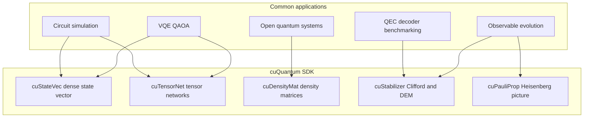
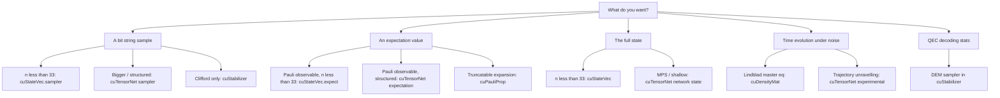

# 03 cuQuantum Overview

cuQuantum is not a single simulator. It is a family of five C libraries that share a common engineering philosophy but solve different physical problems. This chapter is the map: what each library is for, when to choose it, what it costs, and where in the rest of the paper to read about it.

## 3.1 The five libraries at a glance

| Library | Object | Strength | Limit | In-depth chapter |
|---|---|---|---|---|
| cuStateVec | $|\psi\rangle \in \mathbb{C}^{2^n}$ | Exact, gate-by-gate | $n \lesssim$ 33 in one GPU; ~40 with multi-GPU | [10](10-custatevec.md) |
| cuTensorNet | tensor network of small tensors | Hundreds of qubits if low-entanglement / shallow | Highly entangled circuits become exponential again | [20](20-cutensornet.md), [21](21-cutensornet-mps.md) |
| cuDensityMat | $\rho$ and Liouvillians | Open-system dynamics, batched | $O(4^n)$ memory; usually paired with operator structure | [30](30-cudensitymat.md) |
| cuStabilizer | Stabiliser tableau | Clifford circuits, frame sim, DEM sampling | Non-Clifford gates; for QEC-flavoured workloads | [40](40-custabilizer.md) |
| cuPauliProp | Pauli expansion of an observable | Heisenberg evolution with truncation | Truncation is approximation, controlled by user | [50](50-cupauliprop.md) |

## 3.2 Choosing the right library

The decision is mostly driven by the *object* you care about, not the *circuit* you are running.

Some practical heuristics that come up repeatedly:

- *I just want to run my Qiskit/Cirq circuit fast.* Start with cuStateVec; switch to cuTensorNet's high-level network state when the qubit count exceeds what fits.
- *I have a 100-qubit Trotterised time-evolution circuit but small total entanglement.* Use cuTensorNet MPS APIs.
- *I need a derivative through my circuit for VQE.* cuTensorNet supports gradients natively; cuStateVec works with finite differences or custom adjoint code.
- *I am benchmarking a syndrome-extraction circuit at distance $d$.* cuStabilizer.
- *I am studying a Lindbladian on 8 sites with structured operators.* cuDensityMat.
- *I need expectation of a sparse Hamiltonian on a deep but structured circuit.* cuPauliProp, possibly stacked with cuTensorNet for the residual non-Pauli pieces.

## 3.3 Common API idioms

Despite the different physics, the libraries share an API style. If you have used one, the others are recognisable.

### Handle, descriptor, workspace, stream
Each library exposes a `<lib>Handle_t` that owns GPU resources, descriptors that describe the problem, and a workspace pointer for scratch. Heavy work always takes a `cudaStream_t`. See [02-gpu-primer.md §2.5](02-gpu-primer.md).

### Plug-in memory handler
All libraries accept a `MemHandler` (a pair of allocate/deallocate callbacks). Bind one and cuQuantum draws scratch from your pool, which integrates cleanly with CuPy / PyTorch caching allocators. Concretely:

- cuStateVec: `custatevecSetDeviceMemHandler` (see `samples/custatevec/custatevec/memory_handler.cu`).
- cuTensorNet: `cutensornetSetDeviceMemHandler` (used inside `cuquantum.tensornet` automatically).

### Distributed
All libraries that have a distributed mode accept a NCCL communicator and integrate with MPI. The Python wrapper [python/samples/tensornet/contraction/fine/example4_mpi_nccl.py](../python/samples/tensornet/contraction/fine/example4_mpi_nccl.py) is the prototypical Python distributed example; cuDensityMat tests under [python/tests/cuquantum_tests/densitymat/test_state_compute_mpi.py](../python/tests/cuquantum_tests/densitymat/test_state_compute_mpi.py) show the same pattern at the binding level.

### Logging and error strings
Each library exposes a logger callback and `<lib>GetErrorString`. The cuStabilizer test [test_error_string.py](../python/tests/cuquantum_tests/stabilizer/test_error_string.py) exercises every return code as a worked example. Production code should always check return codes and route them through the logger.

## 3.4 The Python layer

The `cuquantum` Python package wraps the C entry points in two layers:

1. **High-level pythonic API** (`cuquantum.tensornet`, `cuquantum.densitymat`, `cuquantum.stabilizer`, `cuquantum.pauliprop`). These take CuPy / NumPy / PyTorch arrays directly, manage handles and workspaces transparently, and are what an application developer writes day to day.
2. **Cython bindings** (`cuquantum.bindings.custatevec`, `cuquantum.bindings.cutensornet`, etc.). One-to-one with the C entry points, useful when you need control the high-level API hides.

The unit tests under `python/tests/cuquantum_tests/bindings/` are the most thorough living documentation of the binding layer, since every C call has a matching parametrised test. The catalogue is [TESTS.md](../TESTS.md).

## 3.5 Sample programs and benchmarks

Two trees of executable documentation accompany the SDK:

- **`samples/`** holds C/C++ samples per library, e.g. [samples/custatevec/](../samples/custatevec/), [samples/cutensornet/](../samples/cutensornet/). They are small and focused and assume a CUDA toolchain.
- **`python/samples/`** holds Python samples organised by library and topic, e.g. [python/samples/tensornet/contraction/coarse/](../python/samples/tensornet/contraction/coarse/), [python/samples/tensornet/experimental/network_state/](../python/samples/tensornet/experimental/network_state/), [python/samples/densitymat/](../python/samples/densitymat/).
- **`benchmarks/nv_quantum_benchmarks/`** is a CLI that drives standard quantum-circuit benchmarks across multiple frontends (Qiskit, Cirq, Qulacs, PennyLane, CUDA-Q) and multiple backends (cuStateVec, cuTensorNet, plus competitors). It is the closest thing to a fair, reproducible measurement harness in this repo. We dissect it in [60-benchmarks.md](60-benchmarks.md).

Every library chapter that follows points back into these trees with file paths and line ranges.

## 3.6 What to read next

- If you want the fundamentals, go to [10-custatevec.md](10-custatevec.md). cuStateVec is the simplest library and the template chapter for the rest.
- If you already know quantum simulation and care about scale, jump to [20-cutensornet.md](20-cutensornet.md) and [21-cutensornet-mps.md](21-cutensornet-mps.md).
- If you have a specific physics application, pick the library chapter that matches and skim the others.
