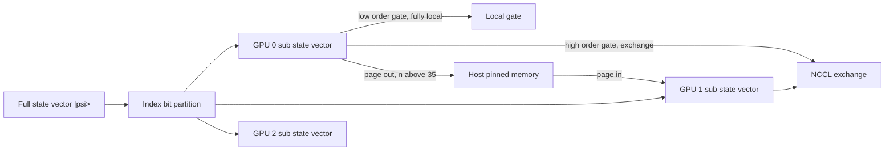

# 10 cuStateVec: Dense State-Vector Simulation

cuStateVec is the foundation library of the SDK. It maintains the full $2^n$-amplitude state vector of $n$ qubits in GPU memory and provides primitives for everything you would do with it: apply gates, take expectations, sample bit strings, measure and collapse, swap qubit indices, partition across multiple GPUs. The mental model is closest to a textbook simulator and is the right place to start reading the SDK.

This chapter is the template that the others will follow. We spend some time on the *engineering* parts that recur (workspaces, batched APIs, multi-GPU partitioning) so the later chapters can refer back here.

## 10.1 Problem statement

Given an $n$-qubit pure state $|\psi\rangle \in \mathbb{C}^{2^n}$ and a stream of operations from the set

\[
\{ \text{apply gate}, \text{measure (Z basis)}, \text{compute expectation}, \text{sample bit-strings} \},
\]

maintain $|\psi\rangle$ exactly (up to floating-point rounding) and answer queries about it.

This is *exact* simulation: no truncation, no approximation. The cost is the cost of carrying the full $2^n$-vector and applying every gate to all of it. With $b$ bytes per amplitude (16 for complex128, 8 for complex64), memory is $2^n \cdot b$ bytes; time per $k$-target gate is $\Theta(2^k \cdot 2^n \cdot b / B)$ assuming a memory-bound kernel and HBM bandwidth $B$.

The horizon on a single H100 PCIe (80 GB) is therefore around 32 qubits at FP64 and 33 at FP32; 33 and 34 respectively if you saturate two GPUs with NVLink. Beyond that, host-device migration (§10.6) buys a few more qubits at significant runtime cost; cuTensorNet becomes the better choice for circuits with structure.

## 10.2 Math: a $k$-qubit gate as a small matrix-vector product

We carefully *do not* form the $2^n \times 2^n$ matrix $G_\text{full} = I \otimes \cdots \otimes G \otimes \cdots \otimes I$. Instead we treat the amplitude vector $\psi$ as a tensor with $n$ binary indices and let the gate act only on the targeted axes.

If $G$ is a $k$-qubit gate acting on axes $T = \{t_0, \dots, t_{k-1}\}$ (and possibly subject to controls $C$ that gate the application), the update is

\[
\psi'_{x} = \begin{cases}
\sum_{y \in \{0,1\}^k} G_{x_T, y}\, \psi_{x_T \to y}, & x_C = \mathbf{1} \\
\psi_x, & \text{otherwise}
\end{cases}
\]

where $x_T \to y$ replaces the targeted-axis bits of $x$ by $y$. Reading: for each of the $2^{n-k}$ "outer" index positions, we read $2^k$ amplitudes, multiply by $G$, write $2^k$ amplitudes. Total memory traffic per gate is $2 \cdot 2^n \cdot b$ bytes regardless of $k$ (so wider gates are not appreciably slower); FLOP count is $\Theta(2^k \cdot 2^n)$ but you are bandwidth-bound for any reasonable $k$. The presence of controls shrinks the *active* subset by a factor $2^{|C|}$ - which is why heavily controlled gates run noticeably faster.

Adjoint application $|\psi\rangle \mapsto G^\dagger |\psi\rangle$ is the same with $G$ replaced by $G^\dagger$ and is exposed as the `adjoint` flag in the API.

## 10.3 GPU strategy

Two implementation tricks are everywhere in cuStateVec.

### Permute-on-the-fly, never materialise

The library does not literally permute axes in memory. Instead each kernel uses bit-twiddling on the linear amplitude index to project out the targeted axes and stream-load just those. This keeps the entire state in its natural layout while still letting the gate act on arbitrarily chosen qubits.

### Sub-state-vector partitioning

For multi-GPU runs the amplitude space is split along the *high-order* qubits: device 0 holds amplitudes whose top $\log_2 P$ bits are $0\cdots 0$, device 1 holds $0\cdots 1$, etc. A gate that targets only *low-order* qubits is purely local and fully parallel; a gate that touches a *high-order* qubit needs an exchange between the two devices owning the affected halves. cuStateVec's *index-bit swap* primitive (`custatevecSwapIndexBits`, sample [samples/custatevec/custatevec/swap_index_bits.cu](../samples/custatevec/custatevec/swap_index_bits.cu)) is the workhorse for re-laying-out the state when this happens.

The *sub-state migrator* extends this to host memory: when even multi-GPU memory cannot hold $|\psi\rangle$, the library pages amplitudes between host RAM and one or more GPUs. Sample: [samples/custatevec/custatevec/subsv_migration.cu](../samples/custatevec/custatevec/subsv_migration.cu). The cost is set by PCIe bandwidth, so this regime is for ~35-40 qubits where you accept seconds-per-gate rather than milliseconds.



## 10.4 The API in five phases

Every cuStateVec workflow walks the phases listed in [02-gpu-primer.md §2.5](02-gpu-primer.md): create handle, describe, configure, allocate workspace, execute. The sample [samples/custatevec/custatevec/gate_application.cu](../samples/custatevec/custatevec/gate_application.cu) is a 90-line walkthrough:

1. Allocate a state vector on the device and copy initial amplitudes (lines 33-37).
2. `custatevecCreate` makes a handle (line 43).
3. `custatevecApplyMatrixGetWorkspaceSize` computes how much scratch is needed (lines 49-51).
4. `cudaMalloc` and bind the workspace (lines 53-55).
5. `custatevecApplyMatrix` executes the gate (lines 58-61).
6. `custatevecDestroy` releases the handle (line 64).

The exact `applyMatrix` call:

```70:90:samples/custatevec/custatevec/gate_application.cu
    HANDLE_ERROR( custatevecApplyMatrix(
                  handle, d_sv, CUDA_C_64F, nIndexBits, matrix, CUDA_C_64F,
                  CUSTATEVEC_MATRIX_LAYOUT_ROW, adjoint, targets, nTargets, controls, nullptr,
                  nControls, CUSTATEVEC_COMPUTE_64F, extraWorkspace, extraWorkspaceSizeInBytes) );
```

The arguments encode (in order): handle; state pointer + dtype + qubit count; gate matrix pointer + dtype + layout + adjoint flag; target qubits + count; control qubits + values + count; compute precision; workspace.

The Python equivalent is one line:

```python
from cuquantum.bindings import custatevec as cusv
cusv.apply_matrix(handle, sv_ptr, CUDA_C_64F, n_qubits,
                  G_ptr, CUDA_C_64F, layout, adjoint,
                  targets, n_targets, controls, control_values, n_controls,
                  CUSTATEVEC_COMPUTE_64F, workspace_ptr, workspace_size)
```

The high-level `cuquantum` Python layer hides the workspace/handle plumbing entirely; it is the right choice for casual use, and the binding layer is the right choice when you control your own buffers.

## 10.5 Operations beyond gate application

cuStateVec has API entry points for everything you typically do to a state vector. We list the most important and point to a sample.

| Operation | C entry point | Sample |
|---|---|---|
| Apply dense gate matrix | `custatevecApplyMatrix` | [gate_application.cu](../samples/custatevec/custatevec/gate_application.cu) |
| Apply diagonal matrix (faster) | `custatevecApplyGeneralizedPermutationMatrix` | [diagonal_matrix.cu](../samples/custatevec/custatevec/diagonal_matrix.cu), [permutation_matrix.cu](../samples/custatevec/custatevec/permutation_matrix.cu) |
| Apply $e^{i\theta P}$ for Pauli $P$ | `custatevecApplyPauliRotation` | [exponential_pauli.cu](../samples/custatevec/custatevec/exponential_pauli.cu) |
| Compute Pauli expectations | `custatevecComputeExpectationsOnPauliBasis` | [expectation_pauli.cu](../samples/custatevec/custatevec/expectation_pauli.cu) |
| Compute dense observable expectation | `custatevecComputeExpectation` | [expectation.cu](../samples/custatevec/custatevec/expectation.cu) |
| Marginal probabilities | `custatevecAbs2SumArray` | [batched_abs2sum.cu](../samples/custatevec/custatevec/batched_abs2sum.cu) |
| Z-basis measurement and collapse | `custatevecMeasureOnZBasis` | [measure_zbasis.cu](../samples/custatevec/custatevec/measure_zbasis.cu) |
| Bulk sampling | `custatevecSampler*` | [sampler.cu](../samples/custatevec/custatevec/sampler.cu) |
| Initialise state | `custatevecInitializeStateVector` | [initialize_sv.cu](../samples/custatevec/custatevec/initialize_sv.cu) |
| Test matrix type (unitary / Hermitian) | `custatevecTestMatrixType` | [test_matrix_type.cu](../samples/custatevec/custatevec/test_matrix_type.cu) |
| External memory handler | `custatevecSetDeviceMemHandler` | [memory_handler.cu](../samples/custatevec/custatevec/memory_handler.cu) |
| Multi-GPU sampler | `custatevecSampler*` w/ subSV scheduler | [mgpu_sampler.cu](../samples/custatevec/custatevec/mgpu_sampler.cu) |
| Multi-GPU index-bit swap | `custatevecMultiDeviceSwapIndexBits` | [mgpu_swap_index_bits.cu](../samples/custatevec/custatevec/mgpu_swap_index_bits.cu) |
| Sub-state migrator | `custatevecSubSVMigrator*` | [subsv_migration.cu](../samples/custatevec/custatevec/subsv_migration.cu) |

Two patterns are worth singling out.

### Pauli expectation without forming the matrix

`custatevecComputeExpectationsOnPauliBasis` accepts a *batch* of Pauli strings and computes all of $\langle\psi|P_i|\psi\rangle$ in one pass over the state. The walkthrough in [samples/custatevec/custatevec/expectation_pauli.cu](../samples/custatevec/custatevec/expectation_pauli.cu) computes two expectations:

```48:52:samples/custatevec/custatevec/expectation_pauli.cu
    HANDLE_ERROR( custatevecComputeExpectationsOnPauliBasis(
                  handle, d_sv, CUDA_C_64F, nIndexBits, expectationValues,
                  pauliOperatorsArray, nPauliOperatorArrays, basisBitsArray, nBasisBitsArray) );
```

The first is $\langle I_1 \rangle = 1$ on qubit 1 (a sanity check; an $I$ term always returns the squared norm of the state); the second is $\langle X_1 Y_2 \rangle = -0.14$ on qubits 1, 2. The library walks the amplitude array exactly once per batch entry, never building the $2^n \times 2^n$ Pauli matrix.

For Hamiltonians written as a sum of Paulis, $H = \sum_i h_i P_i$, the typical idiom is to call this in a single batched invocation and combine the results on the host. This is what cuStateVec-backed VQE pipelines do.

### Sampling = inverse-CDF on $|\psi|^2$

Sampling a bit string is *not* a measurement-and-collapse: it leaves the state unchanged and only requires the amplitude array. The descriptor-based pattern in `sampler.cu` is:

```52:67:samples/custatevec/custatevec/sampler.cu
    HANDLE_ERROR( custatevecSamplerCreate(
                  handle, d_sv, CUDA_C_64F, nIndexBits, &sampler, nMaxShots, 
                  &extraWorkspaceSizeInBytes) );
    ...
    HANDLE_ERROR( custatevecSamplerPreprocess(
                  handle, sampler, extraWorkspace, extraWorkspaceSizeInBytes) );
    ...
    HANDLE_ERROR( custatevecSamplerSample(
                  handle, sampler, bitStrings, bitOrdering, bitStringLen, randnums, nShots, 
                  CUSTATEVEC_SAMPLER_OUTPUT_ASCENDING_ORDER) );
```

`Preprocess` builds the cumulative probability tree once; `Sample` then pulls many shots in a single kernel by binary-searching the tree. The `randnums` argument is an array of $[0,1)$ uniform samples that the user provides - you control the RNG.

The same descriptor scales to multi-GPU through `custatevecSamplerApplySubSVOffset`; see [mgpu_sampler.cu](../samples/custatevec/custatevec/mgpu_sampler.cu) for the orchestration.

## 10.6 Multi-GPU and memory tactics

A single-GPU 30-qubit state at FP64 is 16 GB; doubling to 31 qubits requires 32 GB and pushes against H100 PCIe's 80 GB. Two paths up the qubit ladder:

### NVLink-coupled multi-GPU

Partition by index bits as in §10.3. cuStateVec's high-order-bit gates incur an exchange between the affected sub-states; the rest are local. NCCL handles the data movement. Achievable speedup is close to ideal for *low-order-heavy* circuits (like QFT after relabelling) and bandwidth-bounded for circuits that frequently touch high-order qubits.

### Sub-SV migration

When even multi-GPU memory is too small, [subsv_migration.cu](../samples/custatevec/custatevec/subsv_migration.cu) shows the migrator API: pages move between host pinned memory and one or more GPU sub-states under explicit user scheduling. The user schedules which sub-state needs to be in GPU memory at each gate; the library handles the asynchronous DMA. This is the regime that gets simulators to 35-40 qubits at the cost of being PCIe-bound (so seconds per gate, not milliseconds).

## 10.7 How the test suite covers it

The Python binding-level tests under [python/tests/cuquantum_tests/bindings/test_custatevec.py](../python/tests/cuquantum_tests/bindings/test_custatevec.py) are the most thorough living documentation of cuStateVec. Their structure mirrors the API:

| Test class | What it covers |
|---|---|
| `TestSV`, `TestBatchedSV`, `TestMultiGpuSV` | Fixture: single, batched, multi-GPU state. |
| `TestHandle`, `TestLibHelper`, `TestMathMode` | Handle lifecycle and global config. |
| `TestInitSV` | Initialisation flavours. |
| `TestApply`, `TestBatchedApply` | Dense gate application, single and batched. |
| `TestExpect`, `TestBatchedExpect` | Pauli and dense expectations. |
| `TestSampler` | Full sampler workflow with reference results. |
| `TestMeasure`, `TestMeasureBatched`, `TestCollapse`, `TestBatchedCollapse` | Measurement and collapse. |
| `TestAccessor` | Get and set slices of the state. |
| `TestTestMatrixType` | Unitarity / Hermiticity checks. |
| `TestSwap`, `TestMultiGPUSwap`, `TestBatchMeasureWithSubSV`, `TestSubSVMigrator` | Multi-GPU and migration. |
| `TestMemHandler` | Plug-in allocator. |
| `TestLogger` | C-level logging. |

Each is parametrised over dtypes (`complex64`, `complex128`), input forms (NumPy `ndarray`, raw pointers, CFFI structs), and qubit counts. Reading any of them is a fast way to learn the corresponding API.

## 10.8 Benchmarking it

The relevant `nv_quantum_benchmarks` workloads are:

- `apply_matrix` ([benchmarks/nv_quantum_benchmarks/benchmarks/apply_matrix.py](../benchmarks/nv_quantum_benchmarks/benchmarks/apply_matrix.py)) - times a single dense-matrix gate at a target qubit width. The script computes the effective HBM bandwidth from
\[
\text{eff. BW} = \frac{2^{n-|C|} \cdot 2 \cdot b}{T_\text{GPU}}
\]
which makes it easy to see how close cuStateVec runs to the H100 HBM ceiling (~3 TB/s).
- `apply_gen_perm_matrix` - same for diagonal/permutation gates (which read/write only the diagonal subset and so push higher effective bandwidth).
- `cusv_sampler` ([benchmarks/nv_quantum_benchmarks/benchmarks/cusv_sampler.py](../benchmarks/nv_quantum_benchmarks/benchmarks/cusv_sampler.py)) - times the sampler descriptor and per-shot cost.
- Circuit-level: `qft`, `qaoa`, `quantum_volume`, `qpe`, `random` cycle through the cuStateVec backend.

The CLI invocation pattern is `python -m nv_quantum_benchmarks api apply_matrix --nqubits 28 --ntargets 2 --benchmark-data /tmp/r.json` (see chapter 60).

## 10.9 Pitfalls and tips

- **Workspace reuse.** `*GetWorkspaceSize` is cheap; `cudaMalloc` is not. Allocate the largest workspace your circuit will need once, and pass it to every call.
- **Gate fusion.** cuStateVec does not auto-fuse adjacent gates. If you have a long string of single-qubit gates on one qubit, multiply them on the host first and call `applyMatrix` once.
- **Diagonal vs dense.** Use `custatevecApplyGeneralizedPermutationMatrix` for diagonal gates: it reads/writes far less of the state. cuStateVec also exposes `custatevecApplyPauliRotation` for $e^{i\theta P}$ patterns common in Trotterised time evolution.
- **FP precision.** complex128 is 16 B per amplitude, complex64 is 8 B. Switching halves the time per gate on a memory-bound kernel; use complex64 wherever the algorithm tolerates it.
- **Random-number control.** The sampler takes user-provided uniforms; do not feed it bytes from `cudaRand` if you want reproducibility across stream orderings.
- **Multi-GPU placement.** The `custatevecSampler*SubSVOffset` family relies on the user to place sub-state vectors on the right device. Get this wrong and you silently corrupt the sample distribution.

## 10.10 Run it yourself

```bash
source /home/ysha/cuQuantum/.venv/bin/activate
cd /home/ysha/cuQuantum/python/tests

# Smoke-test the binding layer (a few seconds)
python -m pytest cuquantum_tests/bindings/test_custatevec.py::TestSampler -v

# Benchmark a 28-qubit dense gate
python -m nv_quantum_benchmarks api apply_matrix --nqubits 28 --ntargets 2 \
    --precision-sv complex64 --precision-mat complex64

# Benchmark a 24-qubit sampler
python -m nv_quantum_benchmarks api cusv_sampler --nqubits 24 --nshots 100000
```

On the development H100 PCIe node we typically see [measured: ~2.5 TB/s effective HBM bandwidth] for `apply_matrix` at $n=28$ complex64, well within reach of the H100 peak.

## 10.11 Further reading

- NVIDIA cuStateVec documentation: <https://docs.nvidia.com/cuda/cuquantum/latest/custatevec>
- API reference: each entry-point has a one-page description with all flags.
- Foundational background: section 4 of Nielsen & Chuang for state-vector mechanics; chapter 22 for sampling.

Continue to [20-cutensornet.md](20-cutensornet.md) for the network-based approach to large circuits.
