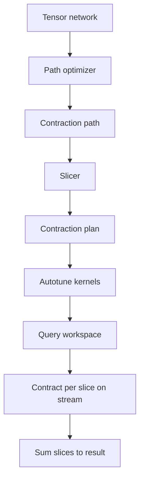

# 20 cuTensorNet: Tensor-Network Contraction

cuTensorNet is the SDK's answer to the exponential wall in chapter 10. Rather than carrying a $2^n$ amplitude vector, it represents the state (or any quantum-information quantity expressible as a sum of products of small tensors) as a *tensor network* and answers queries about it by *contracting* the network. The cost depends on circuit and observable structure, not directly on the qubit count, so the library reaches problem sizes that would be utterly infeasible for cuStateVec - 100 qubits, 200 qubits, sometimes more - whenever the structure permits.

This chapter covers the core contraction engine: networks, paths, slicing, autotuning, gradients, and the C and Python APIs. The high-level network-state APIs and approximate (MPS) methods get their own chapter [21-cutensornet-mps.md](21-cutensornet-mps.md).

## 20.1 What a tensor network is

A **tensor** is a multi-dimensional array. Each axis carries a *mode label* (a symbolic name) and an *extent* (an integer dimension). A **tensor network** is a finite collection of tensors together with mode labels chosen so that some labels appear on more than one tensor (these are the "contracted" or "internal" modes) and some appear only once (the "open" modes). The network represents a single big tensor of rank equal to the number of open modes:

\[
T_{m_\text{open}} = \sum_{m_\text{contracted}} \prod_{\alpha} A^{(\alpha)}_{m_\alpha}.
\]

This is just Einstein summation generalised to many tensors. The Python API uses the einsum string convention: `'ij,jk->ik'` is matrix multiplication.

```17:19:python/samples/tensornet/contraction/coarse/example1.py
a = np.ones((3,2))
b = np.ones((2,3))

r = contract("ij,jk->ik", a, b)
```

That single line goes through the entire pipeline below: the library parses the einsum, finds an efficient contraction path, queries the workspace, executes on a stream, and returns a NumPy array.

For quantum simulation the tensors come from gates and observable factors, the contracted indices come from intermediate qubit states, and the open indices encode whatever you want to read out (an amplitude, a marginal, a sample of bits, an expectation value).

## 20.2 The complexity story

Two costs matter for a tensor network:

- **Memory** at any moment is the size of the largest *intermediate* tensor produced during contraction.
- **Time** is the total FLOPs across all pairwise contractions, which is the sum of contraction costs along whatever order we pick.

The order matters *enormously*: for a network of $k$ tensors, the number of distinct binary contraction trees is $\Omega(k!)$, and the cost difference between the best and a random tree is often many orders of magnitude. Choosing the order is the **contraction-path problem**, and it is NP-hard in general. cuTensorNet's `cutensornetContractionOptimize` is a heuristic search engine over this problem; you typically spend a few seconds on path search to save minutes (or hours) on the contraction itself.

When the optimal path still produces an intermediate that does not fit in memory, **slicing** decomposes the contraction by partitioning the values of one or more modes and summing over slices. This is the analogue of looping over a "free" index by hand. Slicing turns one large kernel into many smaller ones at a cost of repeated work; cuTensorNet picks slice modes to minimise that cost.



## 20.3 The C API in five phases

The cuTensorNet C API is the canonical "describe / configure / workspace / execute" pipeline. The reference walkthrough is [samples/cutensornet/tensornet_example.cu](../samples/cutensornet/tensornet_example.cu); we summarise the key calls.

1. **Handle and descriptor.** `cutensornetCreate` creates a per-device handle. `cutensornetCreateNetworkDescriptor` records the modes, extents, strides, and dtype of every input tensor and the desired output.
2. **Optimizer.** Configure with `cutensornetCreateContractionOptimizerConfig` (knobs for path-finder iterations, slicing strategy, etc.) and `cutensornetCreateContractionOptimizerInfo` (the result). Run `cutensornetContractionOptimize` to fill `Info` with a path and slicing plan.
3. **Plan.** `cutensornetCreateContractionPlan` translates the path into an executable schedule. At this point the library knows which CUTENSOR contractions to issue and in what order.
4. **Workspace and autotune.** Query the workspace via `cutensornetWorkspaceComputeContractionSizes`, allocate, bind, and call `cutensornetContractionAutotune` to time candidate CUTENSOR algorithms for each step.
5. **Execute.** Per slice, call `cutensornetContractSlices`. Slices are independent and can be executed across different streams or even GPUs.

Reusable artefacts: the `Plan`, the autotune results, and the workspace can all be reused across many contractions whose only change is the *operand pointers*. The high-level Python `Network` class exposes this as `network.contract(operands=...)` and is the right level for production code.

## 20.4 The Python API

Two layers, picked depending on whether you need to amortise work across calls.

### Coarse one-shot: `cuquantum.tensornet.contract`

The function in [python/samples/tensornet/contraction/coarse/example1.py](../python/samples/tensornet/contraction/coarse/example1.py) is exactly this; coverage is parametric over input package (NumPy, CuPy, PyTorch), modes notation, and dtypes. See `cuquantum_tests/tensornet/test_contract.py::TestContract` and `TestEinsum` for the extensive test surface.

### Phased reusable: `cuquantum.tensornet.Network`

```python
from cuquantum.tensornet import Network
with Network('ij,jk,kl->il', A, B, C) as net:
    path, info = net.contract_path()      # find the path
    net.autotune()                         # time candidate kernels
    out = net.contract()                   # execute, optionally many times
    net.reset_operands(A2, B2, C2)
    out2 = net.contract()
```

This pattern is in [python/samples/tensornet/contraction/coarse/example15.py](../python/samples/tensornet/contraction/coarse/example15.py) and analogous files. It pays off whenever you contract the same network with different data - exactly the case in variational optimisation, in time-stepping, and in batched expectation-value evaluation.

### Common options

`cuquantum.tensornet.NetworkOptions`, `OptimizerOptions`, `OptimizerInfo`, `PathFinderOptions`, `ReconfigOptions`, `SlicerOptions` are dataclasses you pass via `options=`. Every knob is unit-tested in [python/tests/cuquantum_tests/tensornet/test_options.py](../python/tests/cuquantum_tests/tensornet/test_options.py).

## 20.5 Gradients

Tensor-network contraction is an algebraic expression of the inputs, and so is differentiable. The library implements reverse-mode autodiff at the contraction-tree level: each pairwise contraction has a backward rule that pushes the cotangent up the tree.

The C-side primitive is `cutensornetContractionGradient`, exemplified in [samples/cutensornet/tensornet_example_gradients.cu](../samples/cutensornet/tensornet_example_gradients.cu). The Python side integrates with PyTorch's autograd through CuPy/Torch interop:

- [python/samples/tensornet/contraction/coarse/example23_torch_grad.py](../python/samples/tensornet/contraction/coarse/example23_torch_grad.py) - one-shot gradient through `contract`.
- [python/samples/tensornet/contraction/fine/example5_cupy_grad.py](../python/samples/tensornet/contraction/fine/example5_cupy_grad.py) - phased gradient with CuPy operands.
- [python/samples/tensornet/contraction/fine/example7_resource_mgmt_gradient.py](../python/samples/tensornet/contraction/fine/example7_resource_mgmt_gradient.py) - explicit workspace and stream control.

Tests: `TestContraction::test_contraction_gradient_workflow` parametrises over hundreds of combinations of network shape, modes notation, slicing, and stream-quality settings. This is the workhorse of variational quantum simulation in cuTensorNet.

## 20.6 Slicing

Two scenarios force slicing:

- the largest intermediate exceeds GPU memory;
- you want to parallelise a single contraction across multiple GPUs.

In both cases you tell the optimiser a *budget* (e.g. `slicer_options.memory_model` plus `disable_slicing=False`) and it picks slice modes for you. At execute time the slices are independent contractions, summed afterwards.

Distributed contraction in particular is *just* "different slices on different ranks." See:

- C: [samples/cutensornet/tensornet_example_mpi.cu](../samples/cutensornet/tensornet_example_mpi.cu), [samples/cutensornet/tensornet_example_mpi_auto.cu](../samples/cutensornet/tensornet_example_mpi_auto.cu).
- Python: [python/samples/tensornet/contraction/fine/example2_mpi.py](../python/samples/tensornet/contraction/fine/example2_mpi.py), [python/samples/tensornet/contraction/fine/example4_mpi_nccl.py](../python/samples/tensornet/contraction/fine/example4_mpi_nccl.py).
- Tests: `TestDistributed` in [python/tests/cuquantum_tests/bindings/test_cutensornet.py](../python/tests/cuquantum_tests/bindings/test_cutensornet.py).

Slicing is also what powers cuTensorNet's *amplitudes*, *marginals*, and *sampling* operators on a network state - see chapter 21 for the high-level use.

## 20.7 Tensor decompositions

cuTensorNet exposes QR and SVD as first-class primitives on a tensor with a *partition* of its modes into "row" and "column" groups. These are needed in MPS construction, in gauge-fixing, and inside the contract-decompose primitive that powers approximate methods.

| Primitive | Description |
|---|---|
| `cutensornetTensorQR` | QR of a tensor under a chosen mode partition. |
| `cutensornetTensorSVD` | Truncated SVD with optional fixed extent and threshold. |
| `cutensornetTensorSVDConfig` | Knobs: algorithm (QR-iteration, divide-and-conquer, Jacobi), normalization, partition. |
| `cutensornetTensorSVDInfo` | Returned info: actual extents kept, discarded weight, runtime stats. |

Python samples in [python/samples/tensornet/tensor/](../python/samples/tensornet/tensor/) cover the full matrix:

- `example01-qr_numpy.py`, `example04-svd_numpy.py` - basic flavours.
- `example09-svd_truncation.py`, `example11-svd_algorithms.py` - choose the cut and the algorithm.
- `example12-svd_mem_limit_handling.py` - graceful handling when SVD does not fit.

These primitives are tested in `TestTensorQR`, `TestTensorSVD`, `TestTensorSVDConfig`, `TestTensorGate` (gate splitting via SVD), `TestTensorProductModeConvention`.

## 20.8 The benchmark backend

[benchmarks/nv_quantum_benchmarks/backends/backend_cutn.py](../benchmarks/nv_quantum_benchmarks/backends/backend_cutn.py) is the cuTensorNet backend in the cross-comparison harness. It builds a `Network` from a Qiskit/Cirq circuit, runs the optimiser, and times one or many contractions. This is exactly the path you would use in production; the harness provides a faithful proxy for "how fast does my circuit run on cuTensorNet?".

## 20.9 How the test suite covers it

| Test class | Topic |
|---|---|
| `TestLibHelper`, `TestHandle` | Library/handle. |
| `TestTensorNetworkDescriptor`, `TestTensorNetworkBase` | Network description objects. |
| `TestOptimizerConfig`, `TestOptimizerInfo`, `TestAutotunePreference` | Path optimisation knobs. |
| `TestContraction` | The big one: forward contraction across thousands of parametrisations and the gradient workflow. |
| `TestSliceGroup`, `TestDistributed` | Slicing and multi-process. |
| `TestMemHandler` | External device memory. |
| `TestTensorQR`, `TestTensorSVD`, `TestTensorSVDConfig`, `TestTensorGate` | Decompositions. |
| `TestStateBase`, `TestStateAPIs`, `TestMPSOvercompleteExtentsSUGauge`, `TestMPSNonContiguousStrides` | Network state API (chapter 21). |
| `TestLogger`, `TestMisc` | Logging and miscellany. |

The high-level Python tests under [python/tests/cuquantum_tests/tensornet/](../python/tests/cuquantum_tests/tensornet/) (`test_contract.py`, `test_network.py`, `test_contract_path.py`, `test_circuit_converter.py`) exercise the same APIs through the user-facing layer.

## 20.10 Pitfalls and tips

- **Path finder budget.** The default optimiser is fast and good. For circuits where contraction time exceeds 10s, raise `OptimizerOptions.samples` and `reconfig.num_iterations` - the path search amortises easily.
- **Mixed precision.** Enabling tensor cores inside cuTENSOR is a big win for FLOP-bound networks. cuTensorNet exposes this via `compute_type` (`COMPUTE_32F` with TF32, `COMPUTE_16BF`). Verify accuracy on the smallest representative case first.
- **Reuse the plan.** A `Network` instance can be reused with `reset_operands(...)` for many contractions of the same shape. Do not rebuild the plan in a loop.
- **Memory pool.** Bind a CuPy mempool via `MemHandler`. cuTensorNet's intermediate tensors play nicely with caching allocators.
- **Network construction errors.** The most common bug is a duplicated mode label that you did not intend to contract; the descriptor will accept it without complaint and produce a wrong-shape result. Always sanity-check `OptimizerInfo.opt_cost` against a Python einsum baseline on a small example.
- **Distributed.** Make sure your NCCL communicator is created on the same set of devices that hold the slices, and that the workspace is allocated *per rank*.

## 20.11 Run it yourself

```bash
source /home/ysha/cuQuantum/.venv/bin/activate

# 1. Smoke test the high-level API
python -m pytest python/tests/cuquantum_tests/tensornet/test_contract.py::TestContract -v -k "not cffi"

# 2. Run a coarse Python sample
python python/samples/tensornet/contraction/coarse/example1.py

# 3. Try the gradient through PyTorch
python python/samples/tensornet/contraction/coarse/example23_torch_grad.py

# 4. Drive a circuit through the cutn backend
python -m nv_quantum_benchmarks circuit qft --frontend qiskit --backend cutn --nqubits 32
```

On a single H100 a 32-qubit QFT contracted via cuTensorNet typically lands in [fill in: order of seconds] including path search; rerunning with the cached plan (the harness does this automatically across `nrepeat`) drops the per-iteration cost substantially.

## 20.12 Further reading

- NVIDIA cuTensorNet documentation: <https://docs.nvidia.com/cuda/cuquantum/latest/cutensornet>
- Markov and Shi, "Simulating quantum computation by contracting tensor networks", `arXiv:quant-ph/0511069`.
- Gray and Kourtis, "Hyper-optimized tensor network contraction", `arXiv:2002.01935`.
- Pan, Zhou, Wang, Zhang, "Solving the sampling problem of the Sycamore quantum supremacy circuits", `arXiv:2111.03011`.

Continue to [21-cutensornet-mps.md](21-cutensornet-mps.md) for the high-level "network state" interface and approximate MPS methods.
