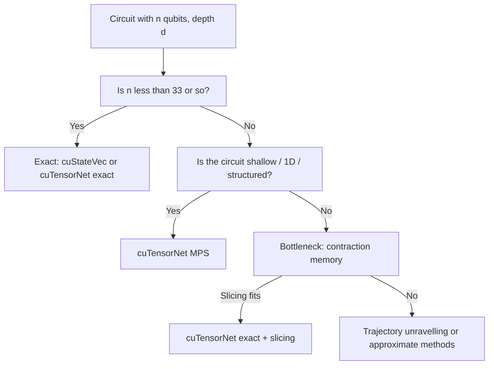

# 21 cuTensorNet: Network State and Approximate MPS

The previous chapter described cuTensorNet as a *contraction engine*: you give it a network and modes, it gives you a tensor. Most users do not start from a tensor network, though - they start from a circuit and want amplitudes, expectations, or samples. cuTensorNet's *Network State* API is the productive entry point for that audience: you build the state from a circuit object (Qiskit, Cirq, or your own), you optionally pick an MPS approximation, and you call high-level methods like `compute_amplitude` and `compute_expectation`. Internally, every call resolves to a contraction (or a sweep of contractions) executed by chapter 20's machinery.

This chapter focuses on:

- the `NetworkState` Python API (and its underlying C `cutensornetState_*` calls);
- the `TNConfig` and `MPSConfig` configuration objects;
- the high-level operators - amplitude, batched amplitudes, marginals, RDM, sampling, expectation, gradient;
- the experimental noisy and trajectory-noise extensions;
- when to use exact vs. MPS.

## 21.1 What is a "network state"?

A *network state* is a description of a quantum state as a tensor network rather than as an amplitude vector. Two flavours that cuTensorNet supports natively:

- **Circuit network state.** A pure state $|\psi\rangle = U_L \cdots U_2 U_1 |0\rangle$ where each $U_i$ is a small-arity gate. The associated network has one tensor per gate and contracts to the state amplitudes.
- **Generic network state.** An arbitrary state whose tensor representation you supply directly (most often an MPS or PEPS-like structure).

For *exact* simulation the network is left general and any query reduces to a contraction:

| Query | Contraction |
|---|---|
| Amplitude $\langle x | \psi \rangle$ | Contract the network with computational-basis tensors at the open ends. |
| Expectation $\langle \psi | O | \psi \rangle$ | Stack the network for $|\psi\rangle$ over the conjugated network for $\langle\psi|$ with $O$ in the middle. |
| Marginal probabilities | Sum over the un-marginalised qubits' open ends in `<bra|ket>`. |
| Reduced density matrix on $S$ | Contract everything except modes for $S$. |

For *approximate* simulation cuTensorNet maintains the state in a **matrix product state (MPS)** form throughout the circuit, applying gates with on-the-fly truncation (§21.4).

## 21.2 The `NetworkState` API in one example

[python/samples/tensornet/experimental/network_state/circuits_qiskit/example01_basic_numpy.py](../python/samples/tensornet/experimental/network_state/circuits_qiskit/example01_basic_numpy.py) is the canonical exact-simulation walkthrough:

```12:48:python/samples/tensornet/experimental/network_state/circuits_qiskit/example01_basic_numpy.py
from cuquantum.tensornet.experimental import NetworkState, TNConfig

n_qubits = 8
circuit = qiskit.circuit.library.QFTGate(n_qubits).definition

config = TNConfig(num_hyper_samples=4)
state = NetworkState.from_circuit(circuit, dtype='complex128', config=config, backend='numpy')

sv = state.compute_state_vector()
amplitude = state.compute_amplitude('0' * n_qubits)
batched_amplitudes = state.compute_batched_amplitudes({0: 0, 1: 1})
samples = state.compute_sampling(100)
expec = state.compute_expectation({'IXIXIXIX': 0.5, 'IYIYIYIY': 0.2, 'IZIZIZIZ': 0.3})
state.free()
```

A few things to notice:

- **`from_circuit`** ingests any object with a Qiskit-compatible interface (Cirq via the `cirq_to_qiskit` shim or the explicit Cirq sample). The circuit is *not* materialised as a state vector; it is captured as a network of gate tensors.
- **`backend='numpy' | 'cupy' | 'torch'`** selects where the *operands* live (and in PyTorch's case enables autograd), while computation always happens on the GPU.
- **One `state` object answers many queries.** Each `compute_*` reuses the underlying network description and only reconstructs the part of the network the query needs. The library caches optimiser results across calls.
- **Pauli operators** are passed as dicts mapping a Pauli string to a coefficient, exactly matching the textbook $H = \sum_i h_i P_i$ representation.

The C-side equivalents are [samples/cutensornet/high_level/amplitudes_example.cu](../samples/cutensornet/high_level/amplitudes_example.cu), [samples/cutensornet/high_level/expectation_example.cu](../samples/cutensornet/high_level/expectation_example.cu), [samples/cutensornet/high_level/sampling_example.cu](../samples/cutensornet/high_level/sampling_example.cu), [samples/cutensornet/high_level/marginal_example.cu](../samples/cutensornet/high_level/marginal_example.cu), [samples/cutensornet/high_level/expectation_gradient_example.cu](../samples/cutensornet/high_level/expectation_gradient_example.cu). The generic network-state version is [samples/cutensornet/high_level/amplitudes_mcg_example.cu](../samples/cutensornet/high_level/amplitudes_mcg_example.cu).

## 21.3 The high-level operators

For each query the library exposes both a Python method and a C `cutensornetState*` primitive:

| Python method | C primitive | What it does |
|---|---|---|
| `compute_state_vector()` | `cutensornetStateCompute` | Produce the full $2^n$ amplitudes (only sane for small $n$). |
| `compute_amplitude(bitstring)` | `cutensornetStateAmplitudes` | Single computational-basis amplitude. |
| `compute_batched_amplitudes(fixed)` | same | Many amplitudes with some qubits fixed and others enumerated. |
| `compute_marginal(qubits)` | `cutensornetStateMarginal` | Probability mass over a chosen subset. |
| `compute_reduced_density_matrix(where)` | `cutensornetStateReducedDensityMatrix` | $\rho_S$. |
| `compute_sampling(nshots)` | `cutensornetStateSampler` | Bit-string samples; see also [samples/cutensornet/high_level/sampling_example.cu](../samples/cutensornet/high_level/sampling_example.cu). |
| `compute_expectation(pauli)` | `cutensornetStateExpectation` | $\langle \sum_i h_i P_i \rangle$. |
| `compute_expectation_gradient(...)` | `cutensornetStateExpectationGradient` | Reverse-mode gradient of an expectation w.r.t. circuit parameters. |

Each of these is unit-tested in [python/tests/cuquantum_tests/tensornet/experimental/test_network_state.py](../python/tests/cuquantum_tests/tensornet/experimental/test_network_state.py): `TestNetworkStateBasicFunctionality`, `TestExactCircuitSimulation`, `TestApproxCircuitSimulation`, `TestExpectationGradient`, `TestAdjointGateCancellation`, `TestNetworkOperator`. The binding-level coverage is in `TestStateAPIs`, `TestMPSOvercompleteExtentsSUGauge`, `TestMPSNonContiguousStrides` in [test_cutensornet.py](../python/tests/cuquantum_tests/bindings/test_cutensornet.py).

## 21.4 Approximate MPS

A **matrix product state** of $n$ qubits is a chain of rank-3 tensors

\[
|\psi\rangle = \sum_{i_1, \dots, i_n}\ \sum_{a_1, \dots, a_{n-1}}\ A^{(1)}_{i_1, a_1}\, A^{(2)}_{a_1, i_2, a_2} \cdots A^{(n-1)}_{a_{n-2}, i_{n-1}, a_{n-1}}\, A^{(n)}_{a_{n-1}, i_n}\ |i_1 \cdots i_n\rangle.
\]

The *bond dimension* $\chi$ is the largest extent of an inter-site bond $a_k$. An MPS exactly represents any state when $\chi$ is allowed to grow up to $2^{\lfloor n/2 \rfloor}$, which is no help. The MPS becomes a useful *approximation* when entanglement is bounded so that a small $\chi$ suffices.

cuTensorNet's MPS path is enabled by passing `MPSConfig(max_extent=chi, rel_cutoff=epsilon)` to `NetworkState.from_circuit`. The library then keeps the state in MPS form throughout the circuit. Each gate is applied as:


For one-site gates the SVD is trivial; for two-site gates it is the standard two-site update; for higher-arity gates the library decomposes through repeated SVDs. The truncation is the source of approximation - `max_extent` caps $\chi$, `rel_cutoff` discards singular values below a relative threshold.

The reference walkthrough is [python/samples/tensornet/experimental/network_state/circuits_qiskit/example06_mps_approx.py](../python/samples/tensornet/experimental/network_state/circuits_qiskit/example06_mps_approx.py):

```22:34:python/samples/tensornet/experimental/network_state/circuits_qiskit/example06_mps_approx.py
config = MPSConfig(max_extent=4, rel_cutoff=1e-5)

with NetworkState.from_circuit(circuit, dtype='complex128', backend='cupy', config=config) as state:
    mps_tensors = state.compute_output_state()
    for i, o in enumerate(mps_tensors):
        print(f"Site {i}, MPS tensor shape: {o.shape}")

    sv = state.compute_state_vector()
    amplitude = state.compute_amplitude('0' * n_qubits)
```

The sample even constructs the explicit MPS site tensors with `compute_output_state()`. Three properties to internalise:

- **Approximate but bounded.** With $\chi$ fixed, the MPS is an exact representation of a $\chi$-bounded entanglement subspace; the gap between the true state and the MPS is exactly the discarded SVD weight per step.
- **Cost is $O(n \chi^3)$ per gate** ignoring constants. So you can scale to hundreds of qubits as long as $\chi$ stays modest.
- **Gauge freedom.** MPS representations are not unique; the library keeps a canonical (left/right or symmetric) gauge to keep the truncations meaningful. `TestMPSOvercompleteExtentsSUGauge` exercises a specifically tricky gauge case.

## 21.5 Network operators and operator-on-MPS

For complex observables - Hamiltonians with hundreds of Pauli terms, Trotterised evolution operators, MPOs (matrix product operators) - cuTensorNet exposes a `NetworkOperator` API that can be applied to a state. The Python entry is `cuquantum.tensornet.experimental.NetworkOperator`; the test [python/tests/cuquantum_tests/tensornet/experimental/test_network_operator.py](../python/tests/cuquantum_tests/tensornet/experimental/test_network_operator.py) walks the constructor.

This is the right layer for:

- expectation of an MPO Hamiltonian against an MPS state (DMRG-flavoured workloads);
- imaginary-time evolution by repeated MPO application + truncation;
- operator-state composition where neither side fits easily as a flat circuit.

## 21.6 Trajectory-noise simulation

cuTensorNet's experimental API includes a *trajectory-unravelling* path for noisy simulation. Each Kraus operator becomes a stochastic gate selected with the appropriate probability; you average expectations over many trajectories. The relevant samples are [example05_noisy_unitary_channels.py](../python/samples/tensornet/experimental/network_state/generic_states/example05_noisy_unitary_channels.py) and [example06_noisy_unitary_channels_mps.py](../python/samples/tensornet/experimental/network_state/generic_states/example06_noisy_unitary_channels_mps.py).

Tests under [python/tests/cuquantum_tests/tensornet/experimental/trajectories_noise/](../python/tests/cuquantum_tests/tensornet/experimental/trajectories_noise/) cover:

- `test_onequbit_channel.py` - bit-flip, depolarising, amplitude-damping single-qubit channels.
- `test_mid_circuit_measurement.py` - parity-corrected mid-circuit measurement.
- `test_quantum_volume_mid_circuit.py` - full QV circuits with MCM under noise.
- `test_large_circuits.py` - bit-flip MaxCut at scale.

This is the right path when the Lindblad evolution of chapter 30 is too expensive (because $\rho$ has $4^n$ entries) but a sample-based estimate of expectations is acceptable.

## 21.7 Choosing exact vs. MPS



Operationally:

- if you fit, run exact and trust the result;
- if you do not fit but entanglement is local, MPS is the workhorse - validate $\chi$ on a small instance before scaling;
- if entanglement is global but you only need expectations / samples, trajectories may save the day.

## 21.8 Pitfalls and tips

- **MPSConfig knobs interact.** `max_extent` is a hard cap; `rel_cutoff` is relative to the largest singular value; `abs_cutoff` is absolute. Pin two of three and report all three in your output.
- **Qubit ordering.** MPS is geometrically a 1D chain; choose a qubit ordering that matches your circuit's locality, not "alphabetical".
- **Caching.** `NetworkState` reuses the optimiser cache across calls. Reset the operands rather than constructing a new state object.
- **Gradient on MPS.** Currently the gradient API is the network-level one (chapter 20); MPS gradients are reachable through that path but require careful operand handling.
- **Determinism.** Sampling and trajectory unravelling consume RNG; pin the seed and pin the stream for reproducibility.

## 21.9 Run it yourself

```bash
source /home/ysha/cuQuantum/.venv/bin/activate

# Exact circuit simulation, NumPy backend
python python/samples/tensornet/experimental/network_state/circuits_qiskit/example01_basic_numpy.py

# Approximate MPS, CuPy backend
python python/samples/tensornet/experimental/network_state/circuits_qiskit/example06_mps_approx.py

# Run the test suite for the experimental tensornet APIs
cd python/tests
python -m pytest cuquantum_tests/tensornet/experimental -v -k "not cffi and not mpi"
```

## 21.10 Further reading

- Schollwoeck, "The density-matrix renormalization group in the age of matrix product states", `arXiv:1008.3477`. The reference for MPS/MPO in physics.
- Vidal, "Efficient classical simulation of slightly entangled quantum computations", `arXiv:quant-ph/0301063`.
- NVIDIA Network State documentation: <https://docs.nvidia.com/cuda/cuquantum/latest/cutensornet/python/api/states.html>.

Continue to [30-cudensitymat.md](30-cudensitymat.md) for open-system dynamics.
