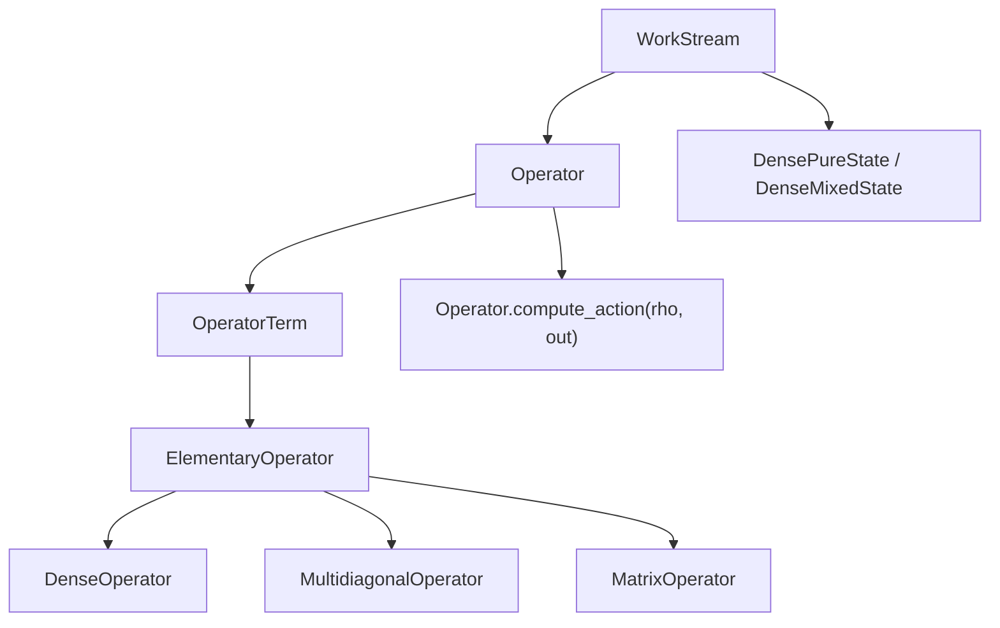

# 30 cuDensityMat: Open-System Dynamics

cuDensityMat is the SDK's library for *open* quantum systems: states that are statistical mixtures (density matrices), evolved by Liouvillians that include dissipative coupling to an environment. Where cuStateVec and cuTensorNet model isolated unitary evolution, cuDensityMat models everything from $T_1$/$T_2$ relaxation in qubits to driven-dissipative many-body physics in optical lattices.

It targets a regime where the user has already done the algebra to identify a finite-dimensional Liouvillian and now needs to act it on a state efficiently. cuDensityMat does not solve master equations - it provides the operator algebra and state-vector products on top of which an integrator can be built.

## 30.1 Mathematical setting

A density matrix $\rho$ on $n$ qudits with local dimensions $d_i$ lives in $\mathbb{C}^{D \times D}$ with $D = \prod_i d_i$. We require $\rho \succeq 0$ and $\mathrm{Tr}(\rho) = 1$. For a 16-site spin-half problem, $D = 2^{16}$ and $\rho$ has $4^{16} \approx 4 \cdot 10^9$ entries - a much harsher exponential than for $|\psi\rangle$.

Time evolution under a Lindblad master equation:

\[
\dot\rho = \mathcal{L}(\rho) = -i[H, \rho] + \sum_j \gamma_j \left( L_j\rho L_j^\dagger - \tfrac{1}{2}\{L_j^\dagger L_j, \rho\}\right).
\]

Here $H$ is a Hamiltonian and $\{L_j\}$ are *jump operators* describing decoherence channels with rates $\gamma_j$. The right-hand side is *linear* in $\rho$ - it is a *superoperator*. cuDensityMat's job is to evaluate $\mathcal{L}(\rho)$, plus its various building blocks ($H\rho$, $\rho H$, $L_j\rho L_j^\dagger$, etc.), efficiently on the GPU. Higher-level integrators (Runge-Kutta, Krylov, MPS-TDVP) call into cuDensityMat for each timestep evaluation.

A few structural observations that drive the API:

- **Operators are sums of tensor products.** Every realistic $H$, $L_j$, or $\mathcal{L}$ can be written as $\sum_\alpha c_\alpha\bigotimes_i \hat{O}_{\alpha,i}$. The library exposes this directly: an `OperatorTerm` is one such tensor-product term, an `Operator` is a sum of terms, with optional batched coefficients $c_\alpha(\theta)$.
- **Most local operators are sparse.** Spin-1/2 sites have 4 entries; bosonic sites have band structure (creation/annihilation are bidiagonal). cuDensityMat distinguishes `DenseOperator` (general) from `MultidiagonalOperator` (banded), with separate code paths and substantial performance benefits.
- **Batched states.** Many problems need a *batch* of states (initial conditions, parameter sweeps). The library natively supports batched dense and pure mixed states; one Liouvillian can be applied to all batch entries with a single call.
- **Distributed.** For large state spaces the library partitions across GPUs / nodes via MPI and NCCL.

## 30.2 Object model



| Object | Role | Sample |
|---|---|---|
| `WorkStream` | Per-device handle. Owns CUDA stream, MPI/NCCL communicator, mempool. | [operator_advanced_example.py](../python/samples/densitymat/operator_advanced_example.py) |
| `DenseOperator`, `MultidiagonalOperator`, `MatrixOperator` | Atomic local operators. | [dense_operator_example.py](../python/samples/densitymat/dense_operator_example.py), [multidiagonal_operator_example.py](../python/samples/densitymat/multidiagonal_operator_example.py), [matrix_operator_example.py](../python/samples/densitymat/matrix_operator_example.py) |
| `OperatorTerm` | Tensor product of atoms with a coefficient. | All of the above. |
| `Operator` | Sum of terms; optionally batched coefficients. | [operator_advanced_example.py](../python/samples/densitymat/operator_advanced_example.py), [batched_operator_example.py](../python/samples/densitymat/batched_operator_example.py) |
| `DensePureState`, `DenseMixedState` | The state $\rho$. Mixed = dense matrix; pure = state vector with mixed-state interface. | [lindbladian_example.py](../python/samples/densitymat/lindbladian_example.py) |
| `GPUCallback`, `CPUCallback` | Time-dependent or parameterised coefficients. | [gradient_*_example.py](../python/samples/densitymat/) |

The naming is deliberate: an `Operator` is a high-level *symbolic* object; `compute_action(input_state, output_state)` is the call that does GPU work.

## 30.3 Building a Liouvillian

The cleanest demonstration is [python/samples/densitymat/lindbladian_example.py](../python/samples/densitymat/lindbladian_example.py): a helper `get_lindbladian(H, jump_ops, gammas)` that assembles $\mathcal{L}$ from a Hamiltonian and Lindblad operators using the pythonic algebra.

```48:71:python/samples/densitymat/lindbladian_example.py
liouvillian = -1j * (hamiltonian + (hamiltonian.dual() * (-1)))
dissipative_part = None
for i, jump_op in enumerate(jump_operators):
    squared_term = jump_op * jump_op.dag()
    two_sided_term = jump_op * jump_op.dual().dag()
    dissipation_strength = dissipation_strengths[i] if isinstance(dissipation_strengths, tuple) else dissipation_strengths
    if not dissipative_part:
        dissipative_part = -1 / 2 * (squared_term * dissipation_strength)
    else:
        dissipative_part += -1 / 2 * (squared_term * dissipation_strength)
    dissipative_part += -1 / 2 * (squared_term.dual() * (dissipation_strength))
    dissipative_part += two_sided_term * dissipation_strength
liouvillian += dissipative_part
```

Three pieces of vocabulary worth highlighting:

- `dual()` returns the *bra-side* dual of an operator: where the original acts on $|\psi\rangle$, the dual acts on $\langle\psi|$. This is how the library represents super-operators that act on $\rho$ from both sides.
- `dag()` is Hermitian conjugation.
- The operator algebra (`+`, `-`, `*`, scaling by Python numbers, NumPy/CuPy arrays, or callbacks) is overloaded; all of it accumulates into a single `Operator` instance that knows how to be applied to a state.

## 30.4 Local operator types

Local operators come in three flavours, each with its own data layout and code path.

| Class | When to use | Underlying data |
|---|---|---|
| `DenseOperator` | Generic local Hamiltonians that are not banded. | Full $d \times d$ matrix per local index. |
| `MultidiagonalOperator` | Bosonic ladder operators, banded local Hamiltonians; very common in physics applications. | Diagonal arrays + offsets. |
| `MatrixOperator` | When you have a precomputed matrix that does not need internal reshape. | Precomputed device-side matrix. |

The unit tests under [python/tests/cuquantum_tests/densitymat/test_elementary_operator.py](../python/tests/cuquantum_tests/densitymat/test_elementary_operator.py) - classes `TestDenseOperatorUnaryOperations`, `TestDenseOperatorBinaryOperations`, `TestMultidiagonalOperator*`, `TestMixedOperations` - exercise the full operator algebra (scalar mul, conjugation, dual, hermitian conjugate, addition, subtraction, matrix product, mixed dense-diagonal interaction) at every supported dtype.

## 30.5 Time-dependent and gradient-friendly operators

Coefficients can depend on time and on a parameter vector. The library accepts:

- a Python `Number`,
- a NumPy or CuPy array (broadcast over the batch axis),
- a `GPUCallback` (kernel-side), or
- a `CPUCallback` (host-side; converted with one HtoD transfer per call).

Callbacks make the operator differentiable with respect to its parameters: see [gradient_scalar_callback_example.py](../python/samples/densitymat/gradient_scalar_callback_example.py) and [gradient_tensor_callback_example.py](../python/samples/densitymat/gradient_tensor_callback_example.py). The C-side counterpart [samples/cudensitymat/operator_action_gradient_example.cpp](../samples/cudensitymat/operator_action_gradient_example.cpp) shows the equivalent C++ workflow; a batched gradient version lives in [samples/cudensitymat/operator_action_batched_gradient_example.cpp](../samples/cudensitymat/operator_action_batched_gradient_example.cpp).

Once you can differentiate the operator action you have a *path* through any ODE integrator that calls `compute_action` - this is what enables learning Liouvillians from data.

## 30.6 Distributed states

For large state spaces the state is partitioned across MPI ranks and NCCL is used for the resulting collective operations. The relevant samples and tests:

- C++: [samples/cudensitymat/operator_action_mpi_example.cpp](../samples/cudensitymat/operator_action_mpi_example.cpp), [samples/cudensitymat/operator_action_nccl_example.cpp](../samples/cudensitymat/operator_action_nccl_example.cpp).
- Python: [python/samples/densitymat/operator_mpi_example.py](../python/samples/densitymat/operator_mpi_example.py), [python/samples/densitymat/operator_mpi_nccl_example.py](../python/samples/densitymat/operator_mpi_nccl_example.py).
- Tests: `test_state_mpi.py::test_creation`, `test_state_compute_mpi.py::TestStateAPI`, `test_work_stream_mpi.py` exercise MPI and NCCL paths under the `mpi` marker.

The communication topology is exposed through `WorkStream`, which can be constructed from an `mpi4py.MPI.Comm`, an MPI pointer, or an NCCL handle. Test [test_work_stream_mpi.py](../python/tests/cuquantum_tests/densitymat/test_work_stream_mpi.py) lists every supported variant.

## 30.7 Pythonic extension layer

The repository also ships a "pythonic" extension (`cuquantum.densitymat` plus context managers) under [python/extensions/](../python/extensions/). It adds:

- `cudensitymat_context()` to scope library lifetime.
- Higher-level helpers for state construction and batched evaluation.
- Tests under [python/extensions/tests/](../python/extensions/tests/) (`TestCudensitymatContext`, `TestOperator`, `TestOperatorTerm`, `TestElementaryOperator`, `TestMatrixOperator`, `TestStateContext`).

For new code we recommend starting from these extensions rather than the bare bindings; they will be the long-term Python entry point.

## 30.8 Spectrum, MPS-TDVP, and beyond

Two notable advanced samples:

- [operator_spectrum_example.py](../python/samples/densitymat/operator_spectrum_example.py) (and the C++ [operator_eigenspectrum_example.cpp](../samples/cudensitymat/operator_eigenspectrum_example.cpp)) compute eigenvalues and eigenvectors of an `Operator` via Krylov methods. This is how you find ground states and Liouvillian spectra.
- [mps_tdvp_example.py](../python/samples/densitymat/mps_tdvp_example.py) (and [samples/cudensitymat/mps_tdvp_example.cpp](../samples/cudensitymat/mps_tdvp_example.cpp)) implement an MPS time-dependent variational principle (TDVP) integrator on top of cuDensityMat, combining MPS state representation with cuDensityMat's operator algebra. This is a real, runnable demonstration of the open-system MPS regime.

## 30.9 Pitfalls and tips

- **Avoid Liouvillian materialisation.** Always express $\mathcal{L}$ as `Operator` + `compute_action`, never as a $D^2 \times D^2$ matrix. Even for $D = 16$ the full Liouvillian is $65536^2$ entries.
- **Multidiagonal where you can.** Bosonic problems want `MultidiagonalOperator`; the speedup over `DenseOperator` is large at high local dimension.
- **Batched coefficients.** When you sweep parameters, batch them; the library evaluates the Liouvillian once per stream rather than once per parameter.
- **Stream and `WorkStream`.** All compute happens on the `WorkStream`'s CUDA stream. If you need overlap, create multiple `WorkStream`s on the same device.
- **MPI initialization.** As with cuTensorNet, `WorkStream(mpi_comm=comm)` must be called *after* `MPI_Init`. The mpi4py auto-init is fine for Python, but the order matters in C/C++.

## 30.10 Run it yourself

```bash
source /home/ysha/cuQuantum/.venv/bin/activate

# Single-process examples
python python/samples/densitymat/dense_operator_example.py
python python/samples/densitymat/lindbladian_example.py
python python/samples/densitymat/operator_spectrum_example.py

# Test suite
cd python/tests
python -m pytest cuquantum_tests/densitymat -v -m "not mpi"

# MPI run, two ranks (requires OpenMPI / MPICH installed)
mpirun -n 2 python -m pytest cuquantum_tests/densitymat -v -m mpi
```

## 30.11 Further reading

- Breuer and Petruccione, *The Theory of Open Quantum Systems*, chapters 3-4 for Lindblad master equations.
- Daley, "Quantum trajectories and open many-body quantum systems", `arXiv:1405.6694`.
- NVIDIA cuDensityMat documentation: <https://docs.nvidia.com/cuda/cuquantum/latest/cudensitymat>.

Continue to [40-custabilizer.md](40-custabilizer.md) for stabiliser simulation.
