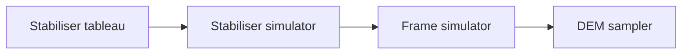

# 40 cuStabilizer: Clifford Simulation and DEM Sampling

cuStabilizer is the SDK's purpose-built engine for the Clifford-dominated regime: stabiliser-state simulation, frame simulation, and detector-error-model (DEM) sampling for QEC decoder benchmarking. The state-vector libraries can in principle do all of this, but at exponential cost. The Gottesman-Knill theorem promises a polynomial algorithm; cuStabilizer turns that promise into kernels that run hundreds of qubits and millions of shots in seconds on a single GPU.

This is a focused chapter: we describe the formalism, the three primary use cases, and the API. The library has a deliberately small surface compared to cuStateVec or cuTensorNet.

## 40.1 The stabiliser formalism, just enough

A stabiliser state of $n$ qubits is the unique $+1$-eigenstate of $n$ commuting independent Pauli operators $\{S_1, \dots, S_n\}$. The state itself is implicit; only the *generators* are stored. The set is closed under:

- Clifford gates (Hadamard, phase $S$, CNOT, and all of their combinations);
- computational-basis measurement and post-selection.

A clean representation is the **stabiliser tableau**: a $2n \times (2n+1)$ binary matrix where rows are stabiliser generators (and their X-Z components) plus a sign bit. Each Clifford gate updates the tableau in $O(n)$ time per row; each measurement takes $O(n^2)$ time worst case. A Clifford+measurement circuit of depth $d$ on $n$ qubits therefore runs in $O(n^2 d)$ time and $O(n^2)$ memory - polynomial!

Two related representations the library uses:

- **Frame simulator state.** Many simultaneous stabiliser states (one per measurement frame) sharing the same circuit. Used to sample many shots in parallel.
- **Detector error model (DEM)**. A DEM is a list of *detectors* (parities of measurements expected to be 0) and *errors* that flip them, with probabilities. Sampling a DEM means sampling, for each shot, which errors fired and which detectors flipped. This is what QEC decoders are evaluated against.

The overall hierarchy:



## 40.2 The three operating modes

### Mode A: stabiliser-state simulator

Build a state, apply Clifford gates, measure, repeat. Sample [test_pythonic_api.py::test_simulation_basic](../python/tests/cuquantum_tests/stabilizer/test_pythonic_api.py) demonstrates the workflow at small scale; at large scale it works the same but with thousands of qubits.

### Mode B: frame simulator

Apply the same Clifford circuit to many copies (frames) of the input state in parallel and measure all of them. cuStabilizer does this with a small constant overhead per frame - essentially batched bitstring kernels - so a million shots of a deep Clifford circuit cost about the same as a single shot.

### Mode C: DEM sampler

Sample bit strings of detector outcomes from a DEM produced by `stim` (or by the stabiliser simulator itself). The DEM is converted into a sparse parity-check structure; sampling reduces to multiplying a random error vector by the parity-check matrix. cuStabilizer offers two algorithms (`sparse` and `dense`) that the library auto-selects based on the DEM's density.

[python/samples/stabilizer/dem_sampling_example.py](../python/samples/stabilizer/dem_sampling_example.py) is the shortest end-to-end demonstration:

```26:48:python/samples/stabilizer/dem_sampling_example.py
circuit = stim.Circuit.generated(
    "surface_code:rotated_memory_z",
    distance=ns.distance,
    rounds=rounds,
    after_clifford_depolarization=ns.prob,
    before_round_data_depolarization=ns.prob,
    before_measure_flip_probability=ns.prob,
)
dem = circuit.detector_error_model(
    decompose_errors=True,
    approximate_disjoint_errors=True,
).flattened()

sampler = DEMSampler(dem, ns.shots, options=Options(device_id=0))
sampler.sample(ns.shots, seed=ns.seed)
```

We let `stim` construct a rotated-memory-Z surface-code circuit at a given distance and noise probability, derive the DEM, hand it to cuStabilizer's `DEMSampler`, and pull `nshots` samples. The output is a CuPy or NumPy array of detector outcomes, optionally bit-packed.

## 40.3 The API

The Python entry points:

| Module | Class | Use |
|---|---|---|
| `cuquantum.stabilizer.simulator` | `Simulator`, `FrameSimulator` | Build a state, apply gates, measure. |
| `cuquantum.stabilizer.dem_sampling` | `DEMSampler`, `BitMatrixSampler` | Sample detector outcomes from a DEM. |
| `cuquantum.stabilizer` | `Options`, error-string helpers | Configuration and diagnostics. |

The C-side primitives are exposed as `custabilizerCreate`, `custabilizerSimulate`, `custabilizerDEMSample`, and the supporting structures. Tests in [test_custabilizer.py](../python/tests/cuquantum_tests/bindings/test_custabilizer.py) at the binding level (small but exhaustive) and [test_pythonic_api.py](../python/tests/cuquantum_tests/stabilizer/test_pythonic_api.py) at the high level.

## 40.4 The test suite as documentation

The cuStabilizer tests are unusually pedagogical and worth pointing out explicitly.

### Pythonic API tests
[test_pythonic_api.py](../python/tests/cuquantum_tests/stabilizer/test_pythonic_api.py) covers:

- `test_circuit_smoke`, `test_frame_simulator_smoke` - the minimal happy paths.
- `test_simulation_basic` - a full circuit + measurement.
- `test_statistical_wrt_stim` - simulates a circuit on cuStabilizer and on `stim`, then asserts the empirical distributions agree to a threshold. Reading this test gives you a rigorous baseline for cross-validation in production.
- `test_h_layer_measure_all`, `test_multiple_circuits_same_simulator`, `test_multiple_runs_same_simulator` - reuse semantics, batching, etc.

### Simulator inputs
[test_simulator_inputs.py](../python/tests/cuquantum_tests/stabilizer/test_simulator_inputs.py) covers the I/O packing options:

- packed vs. unpacked bit strings (matters for memory at large shot counts);
- input table layouts for batched runs;
- `test_simulator_get_pauli_xz_bits_uses_exact_memory_size` - a memory-size invariant.

### DEM sampling
[test_dem_sampling.py](../python/tests/cuquantum_tests/stabilizer/test_dem_sampling.py) is one of the most thorough tests in the repository:

- shape tests, NumPy I/O, CSR sparse interop;
- `test_correctness_wrt_stim_dem_surface_code` - a parametrised statistical correctness check against `stim` for surface-code DEMs at multiple distances and noise probabilities;
- RNG semantics: `test_seed_reproducibility`, `test_consecutive_calls_differ`, `test_max_shots_exceeded`;
- `test_parity_invariant`, `test_deterministic_all_ones` - sanity checks that catch wrong column orderings.

### Error strings
[test_error_string.py](../python/tests/cuquantum_tests/stabilizer/test_error_string.py) maps each `custabilizerStatus_t` value to its string and verifies the Python exception path. Use it as a template for handling library errors elsewhere.

### Frame simulator
[test_frame_simulator.py](../python/tests/cuquantum_tests/stabilizer/test_frame_simulator.py) - a single end-to-end test of the frame-simulator path.

## 40.5 Workflow: surface-code decoder benchmarking

A typical use is benchmarking a decoder's error rate vs. distance, code rate, etc. The recipe:

1. Generate a noisy surface-code memory experiment with `stim` ([dem_sampling_example.py](../python/samples/stabilizer/dem_sampling_example.py) lines 26-37). cuStabilizer can also emit DEMs from a Clifford circuit it has just simulated.
2. Build a `DEMSampler(dem, shots)`.
3. Call `sample(shots, seed=...)` and read `get_outcomes(bit_packed=True)` for compactness.
4. Feed the outcomes to your decoder, compute logical error rate.
5. Iterate over distances and noise levels; keep one process per GPU for shot throughput.

[python/samples/stabilizer/surface_code_example.py](../python/samples/stabilizer/surface_code_example.py) is a worked example tying these steps together.

## 40.6 Why cuStabilizer over `stim`?

`stim` is the de-facto reference for stabiliser simulation. cuStabilizer is the GPU-accelerated counterpart and is shaped to:

- consume `stim`-produced DEMs and circuits directly (the test suite proves agreement);
- run sampling at GPU throughput - the DEMSampler scales to millions of shots per second on H100;
- integrate with the rest of cuQuantum (memory handler, logging, MPI hooks).

For small-scale validation experiments, use `stim`. For sweeping decoder evaluations across many distances and noise levels, use cuStabilizer. The test suite lets you flip between the two at will.

## 40.7 Pitfalls and tips

- **Bit-packing.** Always pass `bit_packed=True` for outcomes when shots exceed 1e5 - the unpacked array is one byte per detector per shot and adds up fast.
- **Sparse vs dense DEM.** Let the library auto-pick (`method=None`). Override only when profiling.
- **Seed.** Set `seed` explicitly; the library uses it deterministically. Two `sample` calls with the same seed and same DEM must produce identical outcomes (`test_seed_reproducibility`).
- **DEMs with hyperedges.** cuStabilizer supports DEMs with edges of arity > 2 via the same code path. `decompose_errors=True` from `stim.Circuit.detector_error_model` simplifies this to standard graph-like DEMs that most decoders expect.
- **Memory budget.** Frames are independent; if you need 10M shots, run 10 batches of 1M. The `Options(device_id=...)` field lets you spread frames across GPUs.

## 40.8 Run it yourself

```bash
source /home/ysha/cuQuantum/.venv/bin/activate

# Generate and sample a surface-code DEM
python python/samples/stabilizer/dem_sampling_example.py --distance 7 --rounds 7 --shots 100000

# Run the test suite (requires `stim` and `numpy`)
cd python/tests
python -m pytest cuquantum_tests/stabilizer -v
```

## 40.9 Further reading

- Gottesman, "The Heisenberg representation of quantum computers", `arXiv:quant-ph/9807006`.
- Aaronson and Gottesman, "Improved simulation of stabilizer circuits", `arXiv:quant-ph/0406196` - the algorithm cuStabilizer implements.
- Gidney, "Stim: a fast stabilizer circuit simulator", `arXiv:2103.02202`.
- NVIDIA cuStabilizer documentation: <https://docs.nvidia.com/cuda/cuquantum/latest/custabilizer>.

Continue to [50-cupauliprop.md](50-cupauliprop.md) for Heisenberg-picture observable evolution.
