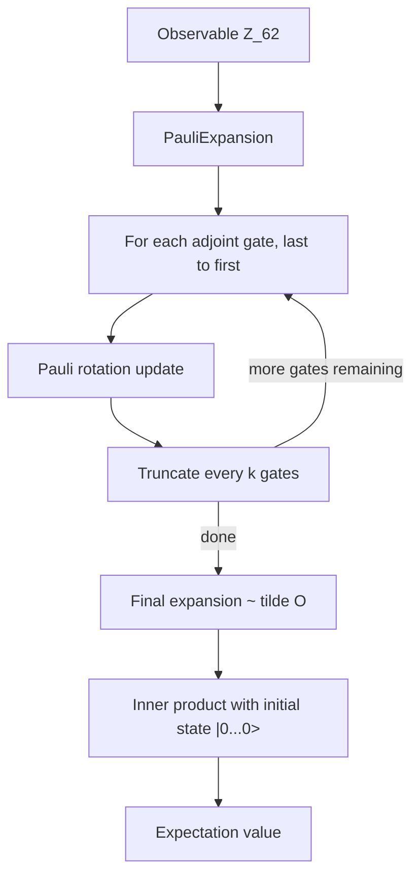

# 50 cuPauliProp: Heisenberg-Picture Pauli Propagation

cuPauliProp is the youngest member of the SDK and the only one that takes the Heisenberg picture seriously as the *primary* representation. Where every other library asks "what is the state?", cuPauliProp asks "what is the observable?": you start with an observable expressed as a sum of Pauli strings, you evolve it backwards through the adjoint circuit, and at the end you contract with a (typically simple) initial state to read off an expectation value. With careful truncation, this works for problem sizes that are out of reach for both state-vector and tensor-network methods.

The library is purpose-built for IBM-style heavy-hex Ising experiments and similar Trotter-style circuits with many qubits but bounded operator support. The reference example in [python/samples/pauliprop/kicked_ising_example.py](../python/samples/pauliprop/kicked_ising_example.py) - 127 qubits, 20 Trotter steps - is illustrative.

## 50.1 Why the Heisenberg picture pays off

Recall (chapter 1) that for any unitary $U$ and observable $O$,

\[
\langle \psi | U^\dagger O U | \psi\rangle = \langle\psi'|O|\psi'\rangle = \langle \psi | \tilde O | \psi\rangle\quad\text{with}\quad\tilde O = U^\dagger O U.
\]

Two things matter:

- **The cost is on $\tilde O$, not on the state.** If $\tilde O$ stays "small" in some sense - few Pauli strings, low operator weight, modest coefficient spread - we never need to materialise the state at all.
- **Many useful observables start small.** A single-qubit $Z_k$ has just one Pauli string. A Hamiltonian sum has on the order of qubits-many. The Heisenberg picture is friendly to *local* observables.

Pauli propagation tracks $\tilde O$ as a list of (Pauli string, coefficient) pairs. Each gate $U$ in the circuit transforms each Pauli string $P$ via $P \mapsto U^\dagger P U$:

- For Cliffords this stays a single Pauli (up to a $\pm 1$ phase).
- For a rotation $U = e^{-i\theta P_g/2}$ around a Pauli generator $P_g$, the transformation is

\[
U^\dagger P U = \begin{cases} P, & [P, P_g] = 0 \\ \cos\theta\, P + i\sin\theta\, P P_g, & \{P, P_g\} = 0 \end{cases}
\]

so the expansion grows by at most a factor of 2 per non-commuting term.

- For a Kraus channel each Pauli becomes a probabilistic mixture of Paulis; the total weight stays $\le 1$ and the bookkeeping is identical.

Without truncation this still grows exponentially in the worst case. The library's central engineering is *truncation* - dropping Paulis whose coefficient or operator weight is smaller than user-set thresholds.

## 50.2 The data structure

A `PauliExpansion` represents

\[
\tilde O = \sum_{i=1}^M c_i\, P_i,\qquad P_i = i^{w_i}\bigotimes_{j=1}^n p_{i,j},\ p_{i,j} \in \{I, X, Y, Z\}.
\]

Memory layout:

- For each of the $M$ Paulis, two packed bit arrays $(x_i, z_i)$ encoding the $X$ and $Z$ components of $P_i$, totalling $2 \lceil n/64\rceil$ uint64s. So 127 qubits => 4 uint64s.
- Per-Pauli coefficient $c_i$ in float32, float64, complex64, or complex128.

Adding a gate involves searching the existing list for collisions, inserting new Paulis or updating coefficients, and re-sorting. The library keeps the list sorted to make collision detection $O(\log M)$ rather than $O(M)$ - this matters when $M$ pushes into the millions.



## 50.3 The Python API by example

The 127-qubit kicked-Ising example builds the picture in steps. Setup:

```108:130:python/samples/pauliprop/kicked_ising_example.py
handle = LibraryHandle()

num_packed = get_num_packed_integers(NUM_CIRCUIT_QUBITS)
xz = cp.zeros((1, 2 * num_packed), dtype=cp.uint64)
coefs = cp.zeros((1,), dtype=cp.float64)
xz[0] = cp.asarray(get_pauli_string_as_packed_integers(["Z"], [62], NUM_CIRCUIT_QUBITS))
coefs[0] = 1.0

options = PauliExpansionOptions(memory_limit="80%", blocking=True)
expansion = PauliExpansion(
    handle,
    NUM_CIRCUIT_QUBITS,
    1,
    xz,
    coefs,
    options=options,
)

truncation = Truncation(pauli_coeff_cutoff=1e-4, pauli_weight_cutoff=8)
num_gates_between_truncations = 10
```

Three knobs to internalise:

- `memory_limit` is a soft cap on device memory, in either an absolute size or a percentage. The library refuses to insert new Paulis when the cap is reached, which is the safe behaviour at scale.
- `Truncation(pauli_coeff_cutoff=eps, pauli_weight_cutoff=w)` drops any Pauli whose coefficient magnitude falls below $\epsilon$ *or* whose operator weight (number of non-$I$ tensor factors) exceeds $w$. The example uses $\epsilon = 10^{-4}$ and $w = 8$, which matches the IBM-paper truncation conventions.
- `num_gates_between_truncations` runs the truncation periodically rather than after every gate (cheaper, marginally less aggressive).

Backward propagation is then a loop over the gates from last to first:

```python
for gate_index in range(len(circuit) - 1, -1, -1):
    expansion.apply_gate(circuit[gate_index].adjoint())
    if gate_index % num_gates_between_truncations == 0:
        expansion.truncate(truncation)
```

After the loop, `expansion` represents $\tilde O = U^\dagger O U$ to within the chosen truncation, and the expectation $\langle 0\cdots 0 | \tilde O | 0\cdots 0\rangle = \tilde O_{II\cdots I}\big|_{x = z = 0}$ - i.e. the coefficient of the all-$Z$ string with zero $X$ component (which is just the diagonal contribution at $|0\rangle$). The library's `inner_product_with_zero_state` (or the lower-level `cotangent_buffer` machinery) computes this directly.

## 50.4 The C and bindings layer

The pythonic `cuquantum.pauliprop.experimental` API used above is built on `cuquantum.bindings.cupauliprop`. Test classes in [test_cupauliprop.py](../python/tests/cuquantum_tests/bindings/test_cupauliprop.py) read like a self-documenting reference:

| Test class | Topic |
|---|---|
| `TestLibHelper`, `TestHandle`, `TestWorkspaceDescriptor` | Library, handle, workspace lifecycle. |
| `TestPauliExpansion`, `TestPauliExpansionViewOperations` | Build, query, slice expansions. |
| `TestCliffordOperators`, `TestPauliRotationOperators`, `TestNoiseChannelOperators` | Apply Cliffords, rotations, channels. |
| `TestCotangentBuffer` | The buffer used to evaluate inner products with the initial state. |
| `TestOperatorApplicationWorkflow` | End-to-end "apply gate, truncate, repeat" loop. |
| `TestTruncationParams`, `TestOperatorApplicationWithTruncation` | Truncation behaviour, edge cases. |
| `TestEnums` | All enum constants are exported. |

The Python `PauliRotationGate(angle, paulis, qubits)` from the kicked-Ising example maps directly to the C `cupauliPropApplyPauliRotation` entry point. The same is true of Clifford gates and noise channels.

## 50.5 Backward differentiation

The cuPauliProp samples include a `kicked_ising_backward_diff_example.py` (and a `_rehearsed.py` variant). Backward differentiation is meaningful because Pauli propagation is itself reverse-time; differentiating the expectation with respect to gate angles requires propagating a *cotangent* buffer alongside the expansion. The library provides this via `CotangentBuffer` and the corresponding `apply_gate_backward` calls.

This is the right tool for variational quantum dynamics where you tune circuit parameters to minimise a cost defined as an expectation - cuPauliProp gives you both the expectation and its gradient in one backward sweep, at the same complexity as the forward sweep.

## 50.6 Truncation and accuracy

Truncation is approximate by definition; the library does *not* track an a priori error bound. Best practice:

- Calibrate $(\epsilon, w)$ on the smallest representative case where you can compare against cuStateVec or cuTensorNet exact.
- Vary one cutoff at a time; observe the convergence of $\langle \tilde O\rangle$.
- Report all cutoffs and the maximum number of Pauli strings reached during the run (the library exposes this).
- For published numbers, run a sensitivity analysis at $\epsilon/10$ and $w+2$ and report both.

This discipline is the whole reason cuPauliProp is positioned as an *advanced* tool - the accuracy is the user's responsibility.

## 50.7 Pitfalls and tips

- **Sort invariant.** The expansion is kept sorted by Pauli identifier; do not bypass the API to write into the underlying buffers without re-sorting.
- **Memory budget.** Set `memory_limit` to a real fraction of HBM. The library will gracefully refuse new Paulis at the limit, but any existing memory you allocated (in CuPy, in PyTorch) counts against the same budget.
- **Truncation cadence.** Truncating every gate is overkill and slow; truncating once at the end is unsafe (memory blows up first). The 10-gate cadence in the kicked-Ising sample is a reasonable default.
- **Adjoint gates.** Because we propagate *backwards*, you must pass `gate.adjoint()` in the loop. The pythonic `PauliRotationGate` returns its adjoint with `.adjoint()`; verify this when you wrap your own gate type.
- **Multiple observables.** Track them as separate `PauliExpansion`s (one per observable). Each can be truncated independently to its own tolerance.

## 50.8 Run it yourself

```bash
source /home/ysha/cuQuantum/.venv/bin/activate

# 127-qubit kicked-Ising backward propagation
python python/samples/pauliprop/kicked_ising_example.py

# Backward-differentiation variant
python python/samples/pauliprop/kicked_ising_backward_diff_example.py

# Test suite
cd python/tests
python -m pytest cuquantum_tests/bindings/test_cupauliprop.py -v -k "not cffi"
```

On the development H100 the kicked-Ising example runs end-to-end in a few seconds for 20 Trotter steps - dramatically faster than the corresponding cuStateVec calculation would be at 127 qubits, which is infeasible.

## 50.9 Further reading

- Begusic, Hejazi, Chan, "Fast and converged classical simulations of evidence for the utility of quantum computing before fault tolerance via tensor networks", `arXiv:2308.05077` - the IBM-utility experiment that drove cuPauliProp's design.
- Rudolph, Carollo, Coopmans, Cuevas, Galda, Kim, Hartmann et al., "Classical simulations of noisy variational quantum algorithms", various - background on truncated Heisenberg propagation.
- NVIDIA cuPauliProp documentation: <https://docs.nvidia.com/cuda/cuquantum/latest/cupauliprop>.

Continue to [60-benchmarks.md](60-benchmarks.md) for the cross-cutting benchmarking harness.
