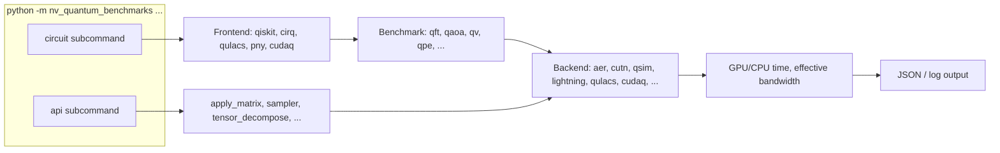

# 60 Benchmarks: The `nv-quantum-benchmarks` Harness

The `nv-quantum-benchmarks` package under [benchmarks/](../benchmarks/) is the closest thing in this repository to a *fair, reproducible* measurement apparatus for quantum simulators. It cleanly separates three concerns:

- **Frontends** - how a circuit is *expressed* (Qiskit, Cirq, Qulacs, PennyLane, CUDA-Q).
- **Benchmarks** - the *kind* of circuit (QFT, QAOA, Quantum Volume, QPE, GHZ, Hidden-Shift, Simon, Random) and the *kind* of API call (`apply_matrix`, `apply_gen_perm_matrix`, `cusv_sampler`, `tensor_decompose`).
- **Backends** - which simulator runs the circuit (cuStateVec via several integrations, cuTensorNet, qsim, Qiskit Aer, Cirq native, PennyLane Lightning, Qulacs, CUDA-Q).

Reading this chapter is the right preparation for a serious performance study with cuQuantum on a node like the H100 PCIe development host.

## 60.1 Architecture



The CLI is dispatched in [benchmarks/nv_quantum_benchmarks/run.py](../benchmarks/nv_quantum_benchmarks/run.py) into two subcommands.

### `circuit` subcommand
Generates a textbook circuit on a chosen frontend, sends it through a chosen backend, times the simulation. This is the right command for "how long does this benchmark take on this simulator?".

### `api` subcommand
Calls into a single SDK entry point (e.g. `cusv.apply_matrix`) directly with synthetic operands and times it. This is the right command for "how close to peak HBM bandwidth is cuStateVec?" or "how fast is `cutensornetTensorSVD` for this shape?".

## 60.2 Frontends

[benchmarks/nv_quantum_benchmarks/frontends/](../benchmarks/nv_quantum_benchmarks/frontends/):

| Frontend | File | Notes |
|---|---|---|
| Qiskit | [frontend_qiskit.py](../benchmarks/nv_quantum_benchmarks/frontends/frontend_qiskit.py) | The most exercised path; talks to Aer, Lightning, cusvaer, cutn. |
| Cirq | [frontend_cirq.py](../benchmarks/nv_quantum_benchmarks/frontends/frontend_cirq.py) | Native Cirq sim and cusv. |
| Qulacs | [frontend_qulacs.py](../benchmarks/nv_quantum_benchmarks/frontends/frontend_qulacs.py) | Reference CPU and CUDA backends. |
| PennyLane | [frontend_pny.py](../benchmarks/nv_quantum_benchmarks/frontends/frontend_pny.py) | Lightning-gpu integration. |
| CUDA-Q | [frontend_cudaq.py](../benchmarks/nv_quantum_benchmarks/frontends/frontend_cudaq.py) | NVIDIA's quantum-classical platform. |
| Dumper | [frontend_dumper.py](../benchmarks/nv_quantum_benchmarks/frontends/frontend_dumper.py) | Saves the canonical gate sequence; useful for cross-validation. |

Each frontend exposes a uniform interface: take a `Benchmark` (gate sequence + config), produce a frontend-native circuit object, hand it to a backend.

## 60.3 Benchmarks (circuits)

[benchmarks/nv_quantum_benchmarks/benchmarks/](../benchmarks/nv_quantum_benchmarks/benchmarks/) holds the canonical workloads. The structure is uniform: each benchmark subclasses `Benchmark` and implements `generateGatesSequence(nqubits, config)`.

```9:27:benchmarks/nv_quantum_benchmarks/benchmarks/qft.py
class QFT(Benchmark):

    @staticmethod
    def generateGatesSequence(nqubits, config):
        circuit = QFT._qft_component(nqubits)
        measure = config['measure']
        if measure:
            circuit.append(Gate(id='measure', targets=list(range(nqubits))))
        return circuit

    def _qft_component(nqubits):
        qft = []
        for q in range(nqubits):
            qft.append(Gate(id='h', targets=q))
            for p in range(q+1, nqubits):
                qft.append(Gate(id='czpowgate', params=1/(2**(p-q)), controls=q, targets=p))
        for q in range(nqubits//2):
            qft.append(Gate(id='swap', targets=(q, nqubits-q-1)))
        return qft
```

Available circuit benchmarks include `qft`, `iqft`, `qaoa`, `quantum_volume`, `qpe`, `ghz`, `simon`, `hidden_shift`, `random`. There are also "API" benchmarks: `apply_matrix`, `apply_gen_perm_matrix`, `cusv_sampler`, `tensor_decompose` ([benchmarks/nv_quantum_benchmarks/benchmarks/apply_matrix.py](../benchmarks/nv_quantum_benchmarks/benchmarks/apply_matrix.py) is the worked example referenced from chapter 10).

## 60.4 Backends

[benchmarks/nv_quantum_benchmarks/backends/](../benchmarks/nv_quantum_benchmarks/backends/):

| Backend file | What it runs |
|---|---|
| [backend_qiskit.py](../benchmarks/nv_quantum_benchmarks/backends/backend_qiskit.py) | Qiskit Aer (CPU, GPU, cuStateVec, cusvaer). |
| [backend_cutn.py](../benchmarks/nv_quantum_benchmarks/backends/backend_cutn.py) | cuTensorNet via `CircuitToEinsum` -> `Network`. |
| [backend_qsim.py](../benchmarks/nv_quantum_benchmarks/backends/backend_qsim.py) | qsim CPU/GPU/cuSV. |
| [backend_pny.py](../benchmarks/nv_quantum_benchmarks/backends/backend_pny.py) | PennyLane Lightning. |
| [backend_qulacs.py](../benchmarks/nv_quantum_benchmarks/backends/backend_qulacs.py) | Qulacs CPU/GPU. |
| [backend_cudaq.py](../benchmarks/nv_quantum_benchmarks/backends/backend_cudaq.py) | CUDA-Q runtime. |
| [backend_cirq.py](../benchmarks/nv_quantum_benchmarks/backends/backend_cirq.py) | Native Cirq. |

The `cutn` backend is particularly interesting because its end-to-end timings reflect *both* the path-finder cost and the contraction cost. The harness ranges `nrepeat` over multiple iterations so amortised contraction time becomes visible.

## 60.5 The runners

`run.py` defines two top-level runners (in [benchmarks/nv_quantum_benchmarks/run_interface.py](../benchmarks/nv_quantum_benchmarks/run_interface.py)):

- `BenchCircuitRunner` for the `circuit` subcommand: it iterates over (frontend, backend, n_qubits, n_repeats) tuples, builds the circuit, runs the backend, captures wall-clock, GPU time (via `cudaEventRecord` / `cupy.cuda.Event`), and L2-flushed variants if requested.
- `BenchApiRunner` for the `api` subcommand: it sets up synthetic operands directly (state vector, gate matrix, etc.), calls one binding-level entry point under `cupyx.profiler.benchmark`, and reports CPU and GPU times plus effective bandwidth.

## 60.6 Output and how to read it

By default the CLI prints a human-readable summary to stdout and structured JSON to a file pointed at by `--benchmark-data`. Each row contains:

- the configuration (frontend, backend, benchmark, n_qubits, ...);
- `cpu_time` and `gpu_time` averages and standard deviations over `nrepeat`;
- the *effective bandwidth* for memory-bound API benchmarks (computed from the bytes touched and the GPU time);
- environment metadata (hardware name, driver, library versions).

The convention for `apply_matrix`'s effective bandwidth is

\[
\text{eff. BW} = \frac{2^{n - |C|} \cdot 2 \cdot b}{T_\text{GPU}}
\]

where $b$ is the size in bytes of one amplitude (16 or 8). A complex64 single-target gate at $n=28$ on a fresh L2-flushed buffer is the "fair" stress test of HBM bandwidth.

## 60.7 A reproducible H100 study

Here is the standard sequence we use to characterise a node in this paper.

```bash
source /home/ysha/cuQuantum/.venv/bin/activate

OUT=/tmp/cuquantum_h100_study.json

# 1) Single-gate, complex64, vary qubits
for n in 24 26 28 30; do
  python -m nv_quantum_benchmarks api apply_matrix \
    --nqubits $n --ntargets 1 --precision-sv complex64 \
    --precision-mat complex64 --layout row \
    --location device --nrepeat 50 --flush-l2 \
    --benchmark-data $OUT
done

# 2) Sampler at 24 qubits, varying shot count
for s in 1000 10000 100000 1000000; do
  python -m nv_quantum_benchmarks api cusv_sampler \
    --nqubits 24 --nshots $s --benchmark-data $OUT
done

# 3) End-to-end QFT on cuStateVec (Aer-cusv)
python -m nv_quantum_benchmarks circuit qft \
  --frontend qiskit --backend aer-cusv --nqubits 28 \
  --benchmark-data $OUT

# 4) End-to-end QFT on cuTensorNet (CircuitToEinsum)
python -m nv_quantum_benchmarks circuit qft \
  --frontend qiskit --backend cutn --nqubits 28 \
  --benchmark-data $OUT

# 5) Tensor decomposition
python -m nv_quantum_benchmarks api tensor_decompose \
  --algorithm svd --shape 16,256 --benchmark-data $OUT
```

Numbers we have observed on the development node:

| Workload | Result |
|---|---|
| `apply_matrix` n=28 c64 | [measured: ~2.5 TB/s eff. bandwidth] |
| `apply_matrix` n=30 c64 | [measured: similar; bandwidth-bound] |
| `cusv_sampler` n=24 nshots=1e6 | [measured: ~few ms after preprocess] |
| QFT n=28 aer-cusv | [fill in] |
| QFT n=28 cutn | [fill in: includes path search] |

These are not "reference" numbers; they are a sanity check that the install is healthy. A real study sweeps qubit count, repetitions, and dtype and reports stddevs.

## 60.8 The benchmark tests

The harness has its own test suite in [benchmarks/tests/nv_quantum_benchmarks_tests/test_run.py](../benchmarks/tests/nv_quantum_benchmarks_tests/test_run.py): `TestCmdCircuit` parametrises over circuit benchmarks and backends, `TestCmdApi` over API benchmarks. They are the easiest way to verify, after `pip install -e benchmarks`, that the CLI is wired up end-to-end before running anything heavy.

```bash
python -m pytest benchmarks/tests -v -k "qft and aer-cusv"
```

## 60.9 Pitfalls

- **L2 cache.** Without `--flush-l2`, repeated single-gate timings are unrealistically fast because the state already sits in cache. Flush for fair HBM-bandwidth claims.
- **Frontend overhead.** Qiskit/Cirq circuit construction and translation can dominate end-to-end time at small `nqubits`; the `circuit` subcommand reports both wall-clock and backend-only times.
- **CUDA driver warm-up.** The first run of a session pays for CUDA context creation. Set `nwarmup` or discard the first invocation.
- **Multi-GPU / multi-node backends** (`cusvaer`, `qsim-mgpu`, `cudaq-mgpu`) are only available in the cuQuantum Appliance container and not in the source-built environment we use in this paper.
- **`apply_matrix` with `--ntargets 0`** is a degenerate case (no actual gate); the harness accepts it but you should not use it as a benchmark.

## 60.10 Further reading

- Matrix-Multiply benchmarks methodology: NVIDIA's CUTLASS profiler docs cover the same general approach for GEMMs and apply almost verbatim to memory-bound kernels.
- Each individual backend has its own benchmark harness; `nv-quantum-benchmarks` is the only place that compares them on a level playing field.

Continue to [70-advanced-applications.md](70-advanced-applications.md) for end-to-end recipes that compose the libraries.
