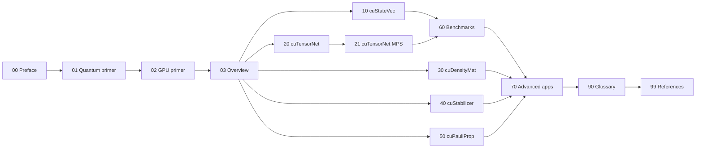

# cuQuantum: Mathematics, Methodology, Technology

A pedagogical technical report on the [NVIDIA cuQuantum SDK](https://developer.nvidia.com/cuquantum-sdk) as exposed by this repository.

This paper is written as a "book in chapters" so it can be read linearly by newcomers or skimmed by experts looking for a specific library or technique. Every chapter grounds abstract content in real, runnable code from this repository.

## Audience

- A student or working scientist new to GPU-accelerated quantum simulation can read 00-03 to get the runway, then proceed library by library.
- A practitioner who already knows the math can skip to chapters 10-50 to learn the API conventions and engineering trade-offs.
- A developer porting an existing simulator or building applications on top of cuQuantum can jump to chapter 70 for end-to-end recipes.

## Table of contents

| File | Topic |
|---|---|
| [00-preface.md](00-preface.md) | How to read this paper, conventions, how to run every example |
| [01-quantum-primer.md](01-quantum-primer.md) | Just-enough quantum mechanics: states, gates, measurements, channels, Pauli algebra |
| [02-gpu-primer.md](02-gpu-primer.md) | Just-enough GPU computing: streams, memory hierarchy, NCCL/MPI, roofline |
| [03-cuquantum-overview.md](03-cuquantum-overview.md) | The five libraries at a glance and when to use each |
| [10-custatevec.md](10-custatevec.md) | cuStateVec: dense state-vector simulation (in depth) |
| [20-cutensornet.md](20-cutensornet.md) | cuTensorNet: tensor-network contraction (in depth) |
| [21-cutensornet-mps.md](21-cutensornet-mps.md) | cuTensorNet: high-level network state and approximate MPS |
| [30-cudensitymat.md](30-cudensitymat.md) | cuDensityMat: open-system / Lindbladian dynamics |
| [40-custabilizer.md](40-custabilizer.md) | cuStabilizer: Clifford simulation and DEM sampling |
| [50-cupauliprop.md](50-cupauliprop.md) | cuPauliProp: Heisenberg-picture Pauli propagation |
| [60-benchmarks.md](60-benchmarks.md) | The `nv-quantum-benchmarks` harness and how to read its output |
| [70-advanced-applications.md](70-advanced-applications.md) | End-to-end recipes that compose the libraries |
| [90-glossary.md](90-glossary.md) | Glossary |
| [99-references.md](99-references.md) | Bibliography and external documentation |
| [figures/](figures/) | Mermaid sources for diagrams referenced from chapters |

## Reading order

Three reasonable paths through the paper.

- **Beginner linear:** 00 -> 01 -> 02 -> 03 -> 10 -> 20 -> 21 -> 30 -> 40 -> 50 -> 60 -> 70.
- **Practitioner skim:** 03 -> the library chapter you need -> 70 for the relevant recipe.
- **Architect deep dive:** 10 + 20 + 21 + 60 to understand what is and is not feasible at scale, then 70.

## Repository anchors

Throughout, paths are relative to the repository root [/home/ysha/cuQuantum/](../) (e.g. `samples/...`, `python/samples/...`, `benchmarks/...`, `python/tests/...`). The companion file [TESTS.md](../TESTS.md) catalogues every unit test referenced in this paper.

## Conventions

- Math: standard Dirac notation. Kets `|psi>` in plain text, `\(|\psi\rangle\)` in inline LaTeX.
- Code: short excerpts only, with file path and line range. Full listings live in the source tree.
- "Run it yourself" boxes give the exact shell command this repository accepts on a single H100 PCIe (the development node) after the install steps in chapter 00.
- No emojis. No screenshots; we use mermaid diagrams in [figures/](figures/) where helpful.

## Status

Draft, May 2026. Numbers tagged `[measured: ...]` were taken on the development H100 PCIe node; numbers tagged `[fill in]` are placeholders for follow-up benchmark passes.
