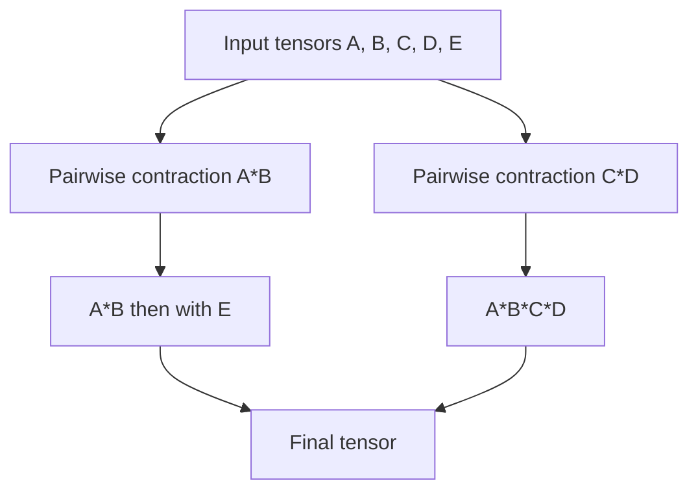
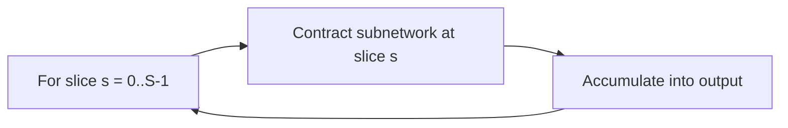

# Figure: Contraction tree and slicing

Referenced from [20-cutensornet.md](../20-cutensornet.md).

If the largest intermediate (e.g. A*B*C*D) does not fit in memory, the optimiser picks one or more *slice modes* whose values are looped over:

Slices are independent and can be assigned to different streams or different GPUs in a distributed run.
