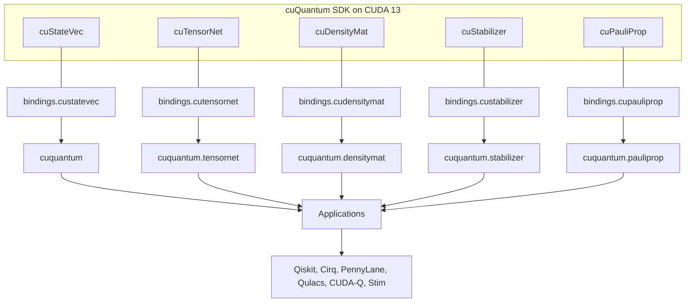

# Figure: cuQuantum Library Landscape

Referenced from [03-cuquantum-overview.md](../03-cuquantum-overview.md).

```mermaid
flowchart TB
    subgraph SDK[cuQuantum SDK on CUDA 13]
        SV[cuStateVec]
        TN[cuTensorNet]
        DM[cuDensityMat]
        ST[cuStabilizer]
        PP[cuPauliProp]
    end
    SV --- BindingsSV[bindings.custatevec]
    TN --- BindingsTN[bindings.cutensornet]
    DM --- BindingsDM[bindings.cudensitymat]
    ST --- BindingsST[bindings.custabilizer]
    PP --- BindingsPP[bindings.cupauliprop]
    BindingsSV --> PySV[cuquantum]
    BindingsTN --> PyTN[cuquantum.tensornet]
    BindingsDM --> PyDM[cuquantum.densitymat]
    BindingsST --> PyST[cuquantum.stabilizer]
    BindingsPP --> PyPP[cuquantum.pauliprop]
    PySV --> Apps[Applications]
    PyTN --> Apps
    PyDM --> Apps
    PyST --> Apps
    PyPP --> Apps
    Apps --> Frontends["Qiskit, Cirq, PennyLane, Qulacs, CUDA-Q, Stim"]
```
