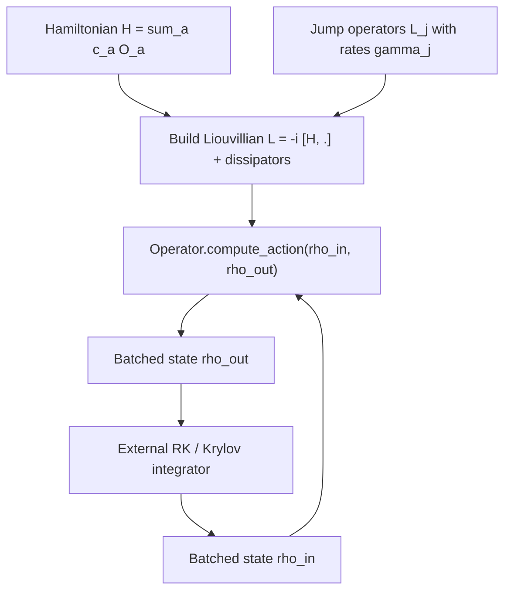

# Figure: Liouvillian batched evaluation in cuDensityMat

Referenced from [30-cudensitymat.md](../30-cudensitymat.md).

The same `Operator` instance is reused across all timesteps and all batch entries. Coefficients can be host-side numbers, device arrays, or callbacks evaluated at each step.
