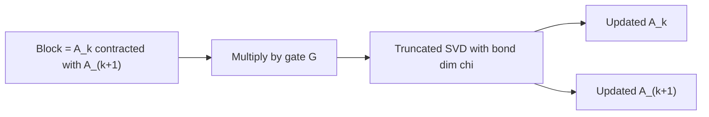

# Figure: MPS gate-application sweep

Referenced from [21-cutensornet-mps.md](../21-cutensornet-mps.md).

Two-site update for a gate G acting on sites k and k+1:

Sweeping left-to-right and right-to-left applies all gates while keeping the state in canonical gauge.
