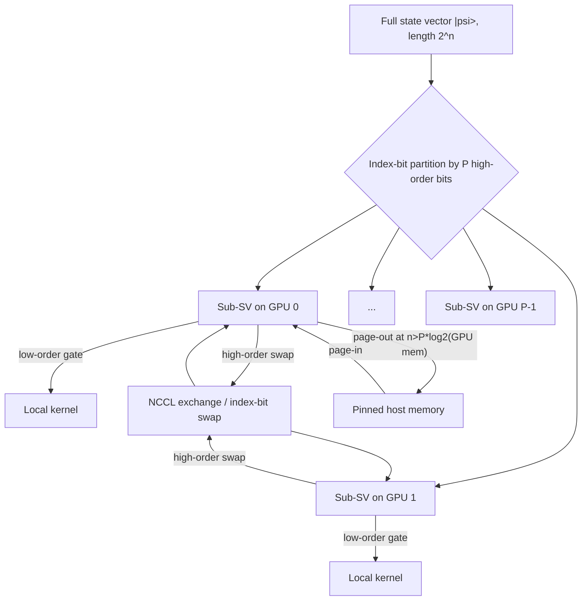

# Figure: cuStateVec multi-GPU and migration

Referenced from [10-custatevec.md](../10-custatevec.md).

The migrator API (`custatevecSubSVMigrator*`) lets the user schedule which sub-SVs reside on which device for each gate; PCIe bandwidth becomes the bottleneck once paging is active.
