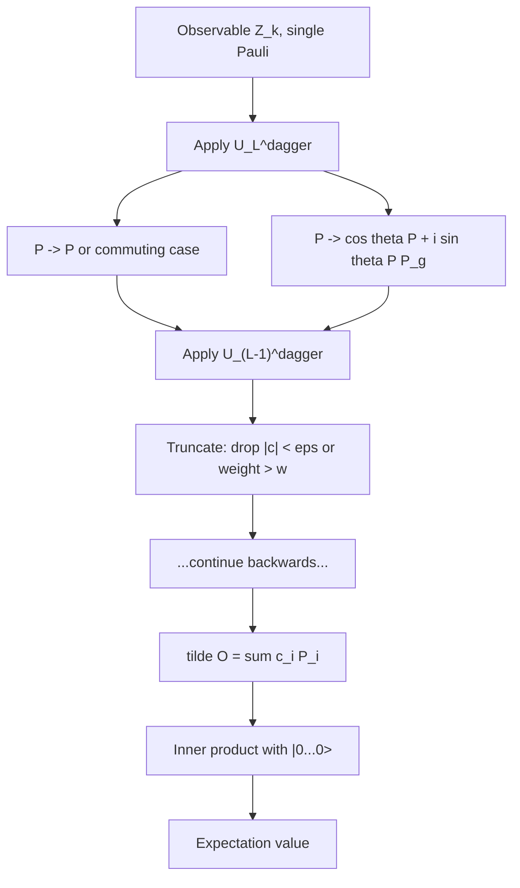

# Figure: Pauli propagation tree

Referenced from [50-cupauliprop.md](../50-cupauliprop.md).

Without truncation the tree branches at every non-commuting rotation and grows exponentially. The library's truncation step prunes coefficients below a threshold and Paulis above an operator-weight cap.
