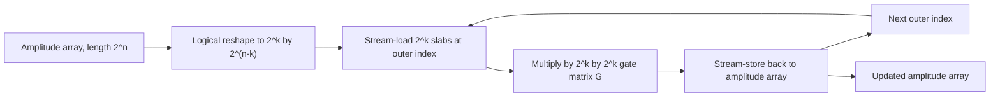

# Figure: cuStateVec gate-application data flow

Referenced from [10-custatevec.md](../10-custatevec.md).

For controlled gates, only outer indices whose control bits match are processed; the rest are passed through. Memory traffic per gate: 2 * 2^n * b bytes regardless of k.
